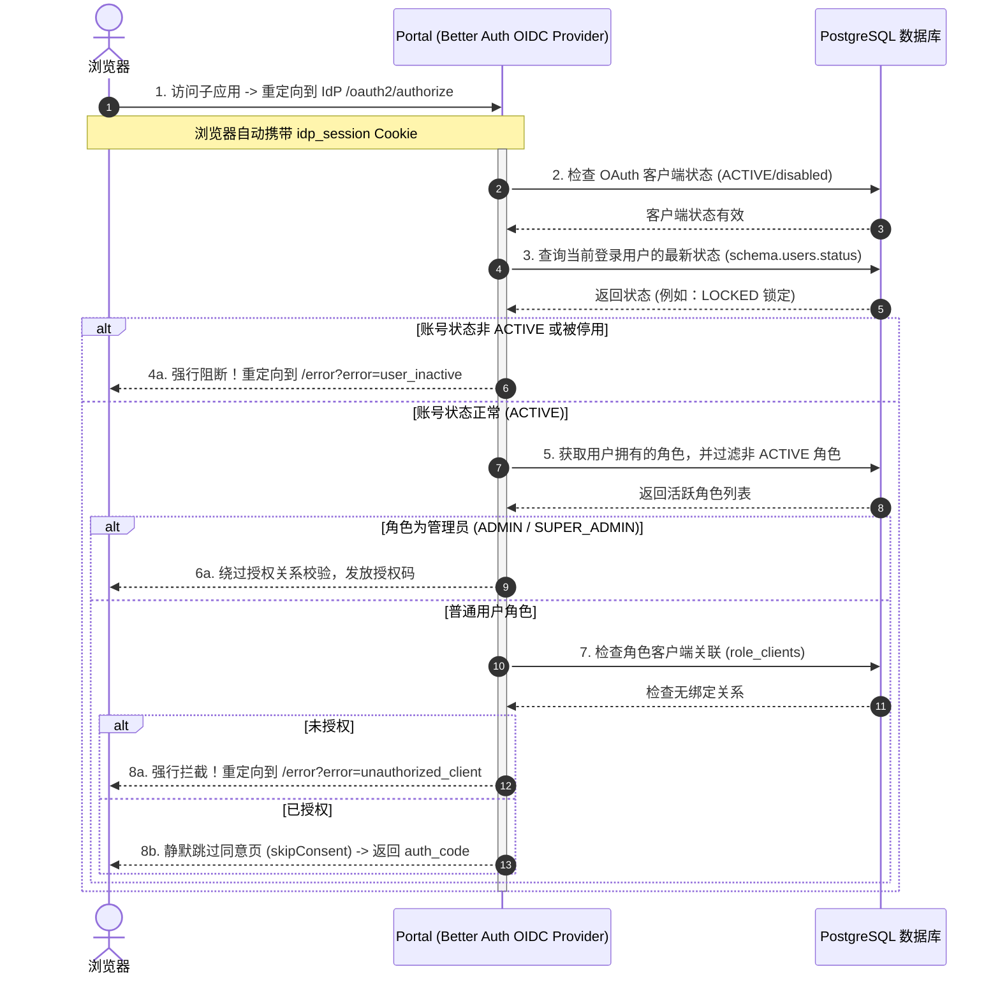
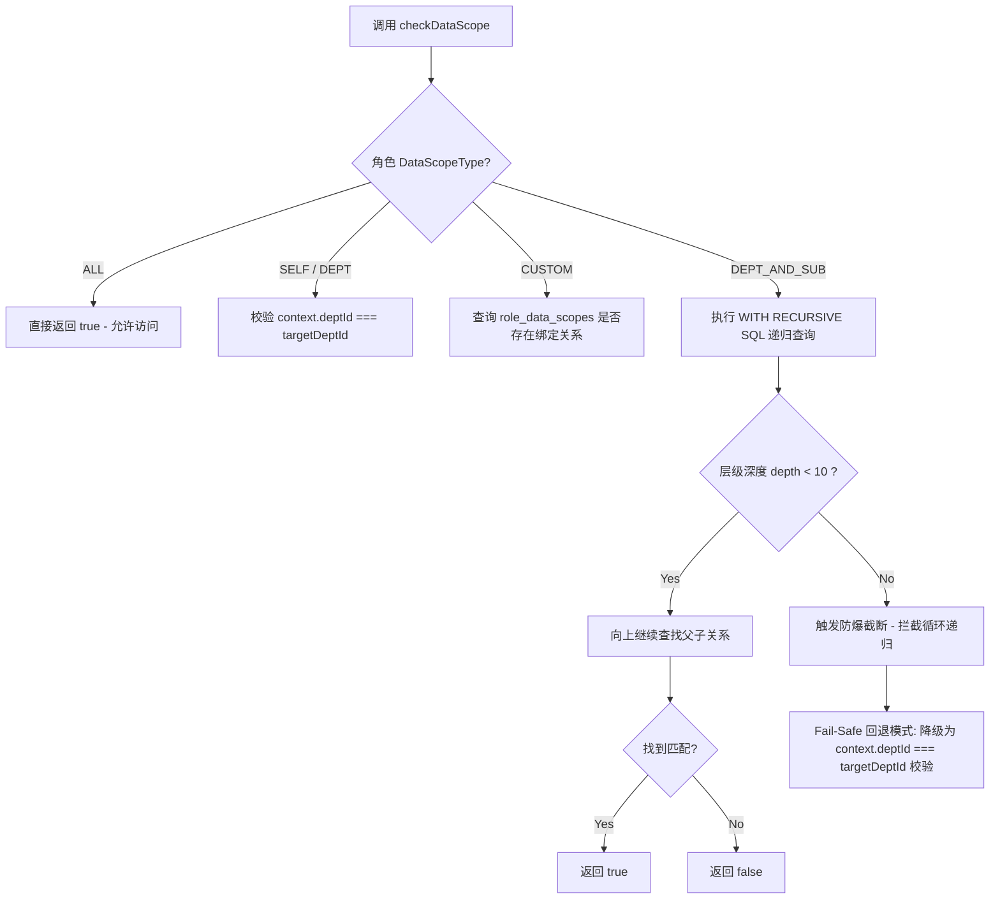

# Auth-SSO 设计系统

版本: v2.2
最后更新: 2026-06-26

---

## 概述

本文档定义 Auth-SSO 产品的视觉设计规范，确保跨页面的一致性和品牌识别度。

**设计原则:**
1. **专业可信**: 深蓝色主色调传达安全和专业
2. **现代精致**: Geist 字体 + 克制动效，摆脱"AI 生成感"
3. **数据优先**: 管理后台突出数据密度和操作效率
4. **中文优化**: 字体选择优先中文显示效果
5. **极简登录**: 登录页减少视觉元素，专注核心操作

---

## 颜色系统

> **v2.2 更新 (2026-06-26):** 全站颜色体系已统一为 oklch。以下 oklch 值与 `apps/portal/src/app/globals.css` 保持同步。
> 组件中应使用 Tailwind 工具类（`bg-primary-subtle`、`text-muted-foreground` 等），禁止硬编码 hex 或 oklch 原始值。

### 品牌色 (Brand — oklch)
| 变量名 | oklch 值 | 用途 |
|--------|---------|------|
| `--color-primary` | `oklch(0.52 0.23 257)` | 品牌蓝 — 按钮、链接、强调色 |
| `--color-primary-hover` | `oklch(0.43 0.21 257)` | 悬停/激活态 |
| `--color-primary-subtle` | `oklch(0.95 0.03 250)` | 浅背景、卡片悬停 |

### 背景色 (Background — oklch)
| 变量名 | 浅色模式 | 暗黑模式 | 用途 |
|--------|---------|---------|------|
| `--color-background` | `oklch(0.99 0.001 253)` | `oklch(0.18 0.02 260)` | 页面底色 |
| `--color-surface` | `oklch(1 0 0)` | `oklch(0.25 0.03 260)` | 卡片/面板背景 |
| `--color-surface-elevated` | `oklch(1 0 0)` | `oklch(0.32 0.03 260)` | 浮层/弹窗背景 |

### 文字色 (Text — oklch)
| 变量名 | 浅色模式 | 暗黑模式 | 用途 |
|--------|---------|---------|------|
| `--color-text-primary` | `oklch(0.18 0.02 260)` | `oklch(0.96 0.01 260)` | 标题、正文 |
| `--color-text-secondary` | `oklch(0.42 0.03 260)` | `oklch(0.68 0.03 250)` | 次要文字 |
| `--color-text-muted` | `oklch(0.68 0.03 250)` | `oklch(0.52 0.03 250)` | 辅助/禁用文字 |

### 语义色 (Semantic — oklch)
| 变量名 | oklch 值 | 用途 |
|--------|---------|------|
| `--color-success` | `oklch(0.67 0.17 165)` | 成功状态 |
| `--color-warning` | `oklch(0.72 0.17 80)` | 警告状态 |
| `--color-error` | `oklch(0.59 0.22 28)` | 错误状态 |
| `--color-info` | `oklch(0.55 0.22 257)` | 信息状态 |

### 边框 & 渐变
| 变量名 | 浅色模式 | 暗黑模式 | 用途 |
|--------|---------|---------|------|
| `--color-border` | `oklch(0.93 0.01 260)` | `oklch(0.32 0.03 260)` | 边框、分割线 |
| `--color-gradient-start` | `oklch(0.52 0.23 257)` | — | 登录页渐变起点 |
| `--color-gradient-end` | `oklch(0.35 0.17 257)` | — | 登录页渐变终点 |

### shadcn 基础体系（不可修改）

以下 shadcn 变量控制 UI 组件前景/背景语义，`--primary` 是**前景文本色**（非品牌蓝），不应修改：

```
--primary:         oklch(0.205 0 0)   (浅色) / oklch(0.922 0 0) (暗黑)
--primary-foreground: oklch(0.985 0 0) (浅色) / oklch(0.205 0 0) (暗黑)
--muted:           oklch(0.97 0 0)    (浅色) / oklch(0.269 0 0) (暗黑)
--muted-foreground: oklch(0.556 0 0)  (浅色) / oklch(0.708 0 0) (暗黑)
```

### 使用规则

- **组件中始终使用 Tailwind class**（`bg-primary-subtle`、`text-muted-foreground`），不直接引用 CSS 变量
- **禁止硬编码 hex 或 oklch 原始值**在 TSX 中（如 `bg-[#E6F0FF]`）——这绕过暗黑模式切换
- **设计新组件时**，颜色选择从已有 design token 中选取，不新增任意颜色值

---

## 字体规范

### 字体家族

| 类型 | 字体 | 说明 |
|------|------|------|
| 中文 | "PingFang SC", "Microsoft YaHei", sans-serif | 中文显示优先 |
| 英文 | "Geist", -apple-system, BlinkMacSystemFont, sans-serif | 现代科技感 |
| 等宽 | "JetBrains Mono", "Fira Code", monospace | 数据、代码 |

**字体加载 (Google Fonts):**

```html
<link href="https://fonts.googleapis.com/css2?family=Geist:wght@400;500;600;700&display=swap" rel="stylesheet">
<link href="https://fonts.googleapis.com/css2?family=JetBrains+Mono:wght@400;500&display=swap" rel="stylesheet">
```

### 字号规范 (更新)

| 名称 | 字号 | 行高 | 用途 |
|------|------|------|------|
| xs | 12px | 16px | 辅助文字、标签 |
| sm | 13px | 20px | 表格、列表项 — 更紧凑 |
| base | 15px | 24px | 正文 — 比 16px 更现代 |
| lg | 17px | 28px | 副标题 |
| xl | 21px | 28px | 卡片标题 |
| 2xl | 27px | 36px | 页面标题 |
| 3xl | 35px | 40px | 大标题 |
| 4xl | 45px | 52px | 登录页品牌名 |

### 字重规范

| 名称 | 值 | 用途 |
|------|-----|------|
| regular | 400 | 正文 |
| medium | 500 | 表格标题、按钮 |
| semibold | 600 | 卡片标题、导航 |
| bold | 700 | 页面标题、品牌名 |

---

## 间距系统

### 基础间距 (基于 4px)

| 名称 | 值 | 用途 |
|------|-----|------|
| 0 | 0px | - |
| 1 | 4px | 紧凑元素间距 |
| 2 | 8px | 图标与文字间距 |
| 3 | 12px | 列表项内间距 |
| 4 | 16px | 卡片内间距、表单字段间距 |
| 5 | 20px | 卡片间距 |
| 6 | 24px | 区块间距 |
| 8 | 32px | 页面区块间距 |
| 10 | 40px | 页面内边距 |
| 12 | 48px | 页面顶部间距 |
| 16 | 64px | 页面底部间距 |

### 布局规范

| 元素 | 值 |
|------|-----|
| 页面内边距 | 24px (移动端) / 40px (桌面) |
| 卡片内边距 | 24px |
| 卡片间距 | 24px |
| 表单字段间距 | 16px |
| 按钮间距 | 12px (组内) / 24px (组间) |
| 导航高度 | 64px (顶部) / 240px (侧边栏展开) |
| 最大内容宽度 | 1440px (管理后台) / 400px (登录页) |

---

## 圆角系统

采用分层圆角，避免视觉单调：

| 名称 | 值 | Tailwind | 用途 |
|------|-----|----------|------|
| sm | 6px | `rounded-lg` | 标签、小按钮 |
| md | 8px | `rounded-lg` (shadcn default) | 按钮、输入框 |
| lg | 12px | `rounded-xl` | 卡片、面板、指标卡 |
| xl | 16px | `rounded-2xl` | 模态框、推广卡片、侧边栏 |
| full | 9999px | `rounded-full` | 徽章、头像 |

---

## 动效系统

### 动效原则

- **克制功能性**: 动效服务于理解，不为装饰而动
- **快速响应**: 用户操作立即得到视觉反馈
- **自然流畅**: 使用合适的缓动曲线

### 缓动曲线

```css
--ease-out: cubic-bezier(0.16, 1, 0.3, 1);      /* 进入动画 */
--ease-in: cubic-bezier(0.7, 0, 0.84, 0);        /* 退出动画 */
--ease-in-out: cubic-bezier(0.87, 0, 0.13, 1);   /* 移动动画 */
```

### 持续时间

| 名称 | 值 | 用途 |
|------|-----|------|
| fast | 100ms | 按钮悬停、开关切换 |
| normal | 200ms | 下拉菜单、面板展开 |
| slow | 300ms | 页面过渡、模态框 |

### 应用场景

| 场景 | 动效 | 持续时间 |
|------|------|----------|
| 按钮悬停 | 背景色渐变 | 100ms |
| 输入框聚焦 | 边框颜色 + 外发光 | 100ms |
| 下拉菜单 | 高度展开 | 200ms ease-out |
| 模态框 | 淡入 + 轻微上移 | 200ms |
| Toast 通知 | 从右侧滑入 | 300ms |
| 卡片悬停 | 上移 4px + 阴影 | 200ms ease-out |

---

## 组件规范

### 按钮

**尺寸:**

| 名称 | 高度 | 水平内边距 | 字号 |
|------|------|-----------|------|
| sm | 32px | 12px | 14px |
| md | 40px | 16px | 14px |
| lg | 48px | 24px | 16px |

**变体:**

| 名称 | 样式 | 用途 |
|------|------|------|
| primary | 主色背景 + 白色文字 | 主要操作 |
| secondary | 透明背景 + 主色边框 + 主色文字 | 次要操作 |
| ghost | 透明背景 + 次要文字 | 辅助操作 |
| danger | 红色背景 + 白色文字 | 危险操作 |

**圆角:** 8px (默认) / 6px (紧凑)

**悬停态:**
- Primary: 背景色加深 (--color-primary-hover)
- Secondary: 背景色填充 (--color-primary-subtle)
- Ghost: 背景色填充 (--color-surface-elevated)

### 输入框

| 属性 | 值 |
|------|-----|
| 默认高度 | 40px |
| 登录页高度 | 48px |
| 圆角 | 8px |
| 内边距 | 12px 16px |

**状态:**

| 状态 | 边框色 Token | 背景 Token |
|------|------------|----------|
| default | `border-border` | `bg-muted/50` |
| focus | `ring-2 ring-primary/10` | `bg-card` |
| error | `border-destructive` | `bg-destructive/10` |
| disabled | `border-border` | `bg-muted` |

**聚焦外发光:**

```css
focus:ring-2 focus:ring-primary/10
```

### 卡片

| 属性 | 值 |
|------|-----|
| 背景 | `bg-card` |
| 边框 | `ring-1 ring-border/50` |
| 圆角 | 12px (`rounded-xl`) |
| 阴影 | 无或 `shadow-sm` |
| 内边距 | 24px |

**悬停态 (可选):**

```css
hover:shadow-md hover:-translate-y-0.5 transition-all duration-200
```

### 数据表格 (DataTable)

DataTable 是共享表格组件，所有列表页统一使用。

**表格行密度:**

| 属性 | 值 |
|------|-----|
| 行高 | 52px（单行）/ 自动（多行） |
| 单元格内边距 | 12px 16px (`px-4 py-3`) |
| 表头字号 | 10px `font-black uppercase tracking-widest` |
| 表头颜色 | `text-muted-foreground` |
| 表头背景 | `bg-muted/50` |
| 数据行字号 | 13px (`text-sm`) |
| 圆角 | 12px (`rounded-xl`) — 同 Card |

**操作按钮（行内）:**

| 属性 | 值 |
|------|-----|
| 尺寸 | 32×32px (`h-8 w-8`) |
| 圆角 | 8px (`rounded-lg`) |
| 变体 | `ghost` |

**空状态:**

- 无数据 → `EmptyState` simple variant + 图标 + 描述 + CTA 按钮
- 首次使用 → `EmptyState` onboarding variant + 步骤 Checklist

**分页器:**

| 属性 | 值 |
|------|-----|
| 位置 | 表格底部，`bg-muted/50` 背景 |
| 页码按钮 | `h-8 w-8 rounded-lg` |
| 页码指示器 | `bg-card border border-border rounded-lg` |

### 按钮圆角（全局统一）

| 元素 | 圆角 | Tailwind |
|------|------|----------|
| 操作/工具栏按钮 | 8px | `rounded-lg` |
| 卡片容器 | 12px | `rounded-xl` |
| 对话框 | 16px | `rounded-2xl` |
| 输入框/表单控件 | 8px | `rounded-lg` |

### 提示信息 (Alert)

| 类型 | 背景 | 文字 |
|------|------|------|
| success | #D1FAE5 | #065F46 |
| warning | #FEF3C7 | #92400E |
| error | #FEE2E2 | #991B1B |
| info | #DBEAFE | #1E40AF |

**样式:**
- 内边距: 12px 16px
- 圆角: 8px
- 字号: 14px

### 状态徽章 (Badge)

| 类型 | 背景 | 文字 |
|------|------|------|
| active | #D1FAE5 | #059669 |
| disabled | #FEE2E2 | #DC2626 |
| pending | #FEF3C7 | #D97706 |

**样式:**
- 内边距: 4px 10px
- 圆角: full (9999px)
- 字号: 11px
- 字重: 500

---

## 页面布局

### 登录页

```
┌─────────────────────────────────────────────┐
│                                             │
│         渐变背景 (#0066FF → #003399)         │
│                                             │
│     ┌─────────────────────────┐             │
│     │                         │             │
│     │       Auth-SSO          │  ← 品牌名   │
│     │   企业统一身份认证平台    │  ← 副标题  │
│     │                         │             │
│     │   ┌─────────────────┐   │             │
│     │   │ 用户名          │   │  ← 输入框  │
│     │   └─────────────────┘   │             │
│     │   ┌─────────────────┐   │             │
│     │   │ 密码            │   │             │
│     │   └─────────────────┘   │             │
│     │                         │             │
│     │   ┌─────────────────┐   │             │
│     │   │      登录       │   │  ← 主按钮  │
│     │   └─────────────────┘   │             │
│     │                         │             │
│     └─────────────────────────┘             │
│              白色卡片，阴影                   │
│                                             │
└─────────────────────────────────────────────┘
```

- 垂直居中布局
- 最大宽度 380px
- 白色卡片 + 柔和阴影
- 渐变背景增加品牌感

### 管理后台

```
┌─────────────────────────────────────────────────────────┐
│ 顶部导航 (64px)                                          │
├──────────┬──────────────────────────────────────────────┤
│          │ 面包屑 > 页面标题              [操作按钮]     │
│ 侧边栏   ├──────────────────────────────────────────────┤
│ (240px)  │                                              │
│          │  ┌──────────┐ ┌──────────┐ ┌──────────┐      │
│ ▸ 工作台 │  │ 用户总数  │ │ 今日登录  │ │ 活跃应用  │      │
│   用户   │  │   1,234  │ │    856   │ │    12    │      │
│   部门   │  └──────────┘ └──────────┘ └──────────┘      │
│   角色   │                                              │
│   应用   │  ┌─────────────────────────────────────┐     │
│   日志   │  │ 表格数据...                          │     │
│          │  │                                      │     │
│          │  └─────────────────────────────────────┘     │
└──────────┴──────────────────────────────────────────────┘
```

- 顶部导航 (64px) + 侧边栏 (240px 可折叠) + 工作区
- 工作区最大宽度 1440px
- 数据密度优先

---

## 反 AI 模板规则

### 禁止使用的模式

| 模式 | 问题 | 替代方案 |
|------|------|---------|
| 紫色渐变背景 | 千篇一律的 SaaS 风格 | 品牌主色调渐变或纯色 |
| 3列特性卡片+图标 | 典型 AI 生成布局 | 功能导向的信息架构 |
| 居中对称布局 | 缺乏层次感 | 左右不对称布局突出重点 |
| 统一大圆角 | 视觉单调 | 分层圆角 (sm/md/lg) |
| 装饰性浮动元素 | 无意义的视觉噪音 | 功能性装饰 |
| emoji 作为设计元素 | 不够专业 | 图标库或自定义图标 |
| Inter 字体 | 滥用导致缺乏辨识度 | Geist / Satoshi 等现代字体 |
| 渐变按钮 | 过度装饰 | 纯色按钮 + 悬停变化 |

---

## 技术架构与核心安全设计

### 1. OIDC 强拦截与状态双重防卫机制

在 Auth-SSO 系统中，为了防范“账户中途被停用/锁定，但仍可利用旧会话进入子系统”以及“普通用户越权访问未授权子应用”的经典安全漏洞，IdP 在授权码发放阶段实施了双重强拦截防卫：
- **实时状态核准**：每次 OAuth 授权请求均会实时穿透查询数据库中用户的最新状态（Active/Disabled/Locked），对非 Active 状态进行强行阻断。
- **动态应用准入**：除超级管理员（SUPER_ADMIN）外，普通用户必须绑定了包含目标客户端的角色关系，否则拒绝准入并重定向至未授权错误页。



### 2. 数据沙箱部门级联与 CTE 递归防死循环

为了支撑精细化数据隔离需求（`ALL` / `DEPT` / `DEPT_AND_SUB` / `SELF` / `CUSTOM`），系统在底层 ORM 执行 SQL 时强制通过中间件注入沙箱判定。
在 `DEPT_AND_SUB` （本部门及子部门）的层级检索中，采用 PostgreSQL 的 `WITH RECURSIVE` 递归查询，并引入了“双重安全防爆与 Fail-Safe 降级”策略，从根源上杜绝因脏数据导致无限递归拖垮数据库的隐患（Infinite Loop DoS）：



### 3. 核心技术亮点沉淀

#### 3.1 递归深度截断与 Fail-Safe 闭环 (安全纵深防御)
在通过 `DEPT_AND_SUB` 递归检查子部门时，系统编写了非常专业的递归 CTE：
```sql
WITH RECURSIVE sub_depts AS (
  SELECT id, 1 as depth FROM departments WHERE id = ${context.deptId}
  UNION ALL
  SELECT d.id, sd.depth + 1 FROM departments d
  INNER JOIN sub_depts sd ON d.parent_id = sd.id
  WHERE sd.depth < 10
)
```
1. **防爆截断**：通过 `sd.depth < 10` 的强制限制，在底层预防了因组织架构环形引用而导致数据库进程彻底死锁的灾难。
2. **Fail-Safe 降级**：若发生任何未预料的底层数据库报错，系统会自动捕获异常并降级回退至 `context.deptId === targetDeptId` 的严格比对，确保安全防线的可用性。

#### 3.2 “孤儿节点自动升顶”优化 (树状渲染容错)
在数据沙箱隔离模式下，当上级部门由于越权被隐藏时，直接使用 `parentId` 会导致子部门在前端“彻底失联且无法渲染”。
系统在构建部门树时动态校验：**如果某个节点的父节点不在用户的授权数据范围内，该子节点自动升级成为当前虚拟树的“根节点（Root）”进行渲染**，优雅解决了经典的树状 RBAC 渲染遗失缺陷。

#### 3.3 部门强一致性完整约束 (防脏数据)
在部门信息的更新和删除事务中引入强关联拦截：
1. **防自引用死循环**：`PUT` 更新接口严格拦截了 `parentId === id` 的操作，防止部门认自己做“父亲”的死循环。
2. **级联拦截保护**：`DELETE` 删除时，前置检索是否有子部门，若存在子节点则强制拦截并返回错误代码，防范了物理删除产生破坏性“数据孤儿”。

### 4. 前端权限页面级强拦截防卫

为防御未授权用户或 Session 超时用户越权窥探管理系统的 UI 布局框架，前端实施了页面级鉴权拦截：
- **主动式 401 拦截**：在 `DashboardLayout` 组件的 React `useEffect` 初始化中，并发拉取 `/api/me` 和 `/api/me/menus` 接口。若获取账户上下文时 API 返回 `401 Unauthorized` 状态，前端拦截器将强行阻断页面渲染并清空状态。
- **连贯体验 (callbackUrl) 流转**：在触发 401 拦截时，前端会自动将当前访问的完整路径（`pathname + search`）进行安全编码为 `callbackUrl` 附加在重定向地址中。登录页接收此参数并动态拼接到 OAuth 授权接口的 `redirect` 中，从而保障用户在身份验证成功后能够平滑、无缝地回弹至原本访问的目标页面。

---

## 更新日志

| 日期 | 版本 | 变更 |
|------|------|------|
| 2026-06-26 | v2.2 | 颜色体系全量迁移至 oklch（globals.css 同步）；圆角系统扩增 `rounded-2xl` (16px)；组件规范引用 design token 替代 hex |
| 2026-05-20 | v2.1 | 增补 OIDC 强拦截与数据沙箱核心架构设计图；修复并补充前端页面级 401 拦截与带 callbackUrl 的重定向体验方案 |
| 2026-03-24 | v2.0 | 更新主色为 #0066FF；引入 Geist 字体；新增动效系统；新增暗黑模式 |
| 2026-03-24 | v1.0 | 初始设计系统定义 |