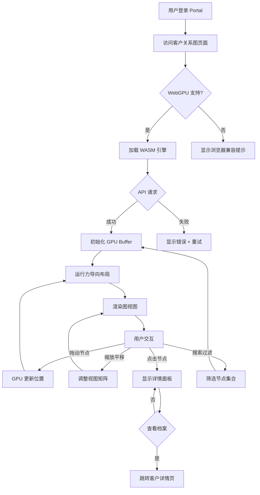

# 客户关系图可视化引擎

## Problem Frame

企业需要直观展示客户之间的关联关系图谱。10,000+ 节点 + 10,000+ 边的大规模关系图，要求布局自然、无重叠、拖动流畅。

**关键洞察**：大图可视化的核心挑战不是渲染性能，而是**可理解性**——人类认知容量有限（约 7±2 项目同时跟踪），需要聚类、过滤、渐进式披露来辅助理解。

## Technical Approach

**选定方案**：Rust + wgpu + WebGPU + WASM（业界最高性能方案）

### 性能对比

| 指标 | Rust/WASM/WebGPU | Sigma.js (WebGL) | Cytoscape.js |
|------|------------------|------------------|--------------|
| 渲染引擎 | WebGPU Compute Shader | WebGL | Canvas/WebGL |
| 布局计算 | GPU 并行计算 | Web Worker (CPU) | CPU |
| 理论节点上限 | 100K+ | 50K | 10K-30K |
| 布局收敛时间 | <1s (GPU) | 3-5s | 5-10s |
| 包体积 | ~500KB (WASM) | ~200KB | ~300KB |
| Safari 支持 | ❌ WebGPU 不可用 | ✅ | ✅ |

**选择理由**：
1. GPU Compute Shader 实现真正的并行力导向计算
2. 空间网格加速在 GPU 上效率最高
3. 未来可扩展到 100K+ 节点规模
4. 单次 draw call + Instanced Rendering = 最高渲染效率

### 兼容性策略

WebGPU 浏览器支持：Chrome 113+、Edge 113+、Firefox 实验性、Safari 不支持

**降级方案**：检测 WebGPU 支持，不支持时显示提示页面，引导用户使用 Chrome/Edge 浏览器访问。暂不实现 WebGL 降级（开发成本翻倍），后续迭代可考虑。

## Requirements

**核心可视化**
- R1. 支持上万节点（10,000+）和上万边（10,000+）同时渲染
- R2. GPU Compute Shader 实现力导向布局算法，有关系的节点互相吸引，无关系的互相排斥
- R3. 碰撞检测与推开（GPU 并行计算）
- R4. 布局自然收敛，初始布局稳定后可交互

**可理解性（大图必备）**
- R5. **聚类视图**：缩小时自动聚合相似节点为超级节点，显示聚类规模
- R6. **渐进式披露**：初始显示核心节点（度数 Top 100），随缩放逐步展开
- R7. **节点视觉编码**：
  - 节点大小 = 关联边数量（度数）
  - 节点颜色 = 客户类型（可选分类）
  - 选中/悬停节点高亮显示
- R8. **关联高亮**：点击节点时高亮其所有邻居节点和边

**交互功能**
- R9. 鼠标拖动单个节点，实时更新布局（GPU 回传位置）
- R10. 滚轮/双指缩放画布，鼠标拖动平移
- R11. 悬停显示节点详情面板：
  - 客户名称、ID
  - 关联客户数量
  - 主要关联类型
  - "查看档案" 按钮（跳转客户详情页）
- R12. 搜索定位节点（按名称/ID），支持模糊匹配
- R13. 过滤显示子集：
  - 按客户类型过滤
  - 按关联数量过滤（≥N 条关系）
  - 按数据来源过滤

**性能约束**
- R14. 布局计算在 GPU 完成（Compute Shader），不阻塞主线程
- R15. 空间网格加速，斥力计算复杂度 O(n)
- R16. 单次 draw call 绘制全部节点（Instanced Rendering）
- R17. 60 FPS 渲染响应

**数据与认证**
- R18. 数据源为外部 API 导入（格式见下方契约）
- R19. 集成现有 IdP SSO 认证：
  - 访问权限：已登录的 Portal 用户
  - 数据范围：用户可见的客户关系数据（根据 RBAC 权限）
- R20. 外部 API 认证：Portal 后端代理调用，使用服务端凭证

**加载与错误处理**
- R21. 加载状态：WASM 加载进度条、API 请求中、GPU 初始化中、布局计算中
- R22. 错误状态：
  - API 失败：显示重试按钮
  - WebGPU 不支持：显示浏览器兼容性提示，引导使用 Chrome/Edge
  - GPU 初始化失败：显示错误信息
- R23. 空状态：无数据时显示"暂无客户关系数据"提示
- R24. 搜索/过滤无结果：显示"未找到匹配的客户"提示

**部署**
- R25. 新建 Next.js 应用 `apps/customer-graph`
- R26. WASM 引擎编译为独立 crate `wasm-engine/`
- R27. Vercel 统一部署，包含 Rust 编译步骤

## Success Criteria

- 10,000 节点 + 10,000 边数据集可流畅渲染（60 FPS）
- 节点拖动响应延迟 < 16ms
- 初始布局收敛时间 < 5 秒（GPU 加速）
- 用户可在 30 秒内找到目标客户节点（搜索 + 过滤 + 聚类）
- WASM 包体积 < 500KB（压缩后）
- Chrome/Edge 浏览器完全支持

## Scope Boundaries

- 不实现边（连线）的动态样式或权重可视化（统一灰色细线）
- 不支持实时数据推送更新（页面刷新获取最新数据）
- 不实现图编辑功能（添加/删除节点/边）
- 不支持多图同时显示或图切换
- 不支持移动端触摸交互（后续迭代）
- 不实现 WebGL 降级（仅支持 WebGPU 浏览器）

## Key Decisions

- **技术栈**: Rust + wgpu + WebGPU + WASM
- **渲染引擎**: WebGPU Compute Shader + Instanced Rendering
- **布局算法**: GPU 并行力导向（自定义实现）
- **加速策略**: 空间网格划分 + GPU 并行斥力计算
- **开发节奏**: WASM 引擎核心先行，再对接 Next.js 前端

## External API Contract

**Endpoint**: `GET /api/customer-relationships`

**Request Headers**:
```
Authorization: Bearer <portal-session-token>
```

**Response**:
```json
{
  "nodes": [
    {
      "id": "customer-001",
      "label": "客户名称",
      "type": "enterprise|individual",
      "metadata": {
        "relationshipCount": 15,
        "primaryIndustry": "行业"
      }
    }
  ],
  "edges": [
    {
      "source": "customer-001",
      "target": "customer-002",
      "type": "partnership|investment|supply"
    }
  ],
  "meta": {
    "totalNodes": 10500,
    "totalEdges": 12000,
    "lastUpdated": "2026-04-08T10:00:00Z"
  }
}
```

## Dependencies / Assumptions

- 用户浏览器支持 WebGPU（Chrome 113+、Edge 113+），Safari 用户需使用其他浏览器
- 外部 API 响应时间 < 3 秒
- IdP Portal 已部署并运行，可复用 OAuth Client 配置
- 客户数据已在 IdP 或外部系统中维护
- 开发团队具备 Rust 开发能力或愿意学习

## Outstanding Questions

### Resolve Before Planning

- [Affects R11] 点击跳转的客户档案页面路径是 Portal 内部页面还是外部系统？需要确认 URL 格式
- [Affects R27] Vercel 构建镜像是否包含 Rust 工具链？是否需要自定义构建步骤？

### Deferred to Planning

- [Affects R5] 聚类算法选择（Louvain 社区发现 vs K-Means vs 手动分组）
- [Affects R13] 过滤条件的具体维度由业务方确认
- [Affects R9] WASM 与 Next.js 的通信桥接方案（wasm-bindgen API 设计）
- [Affects R16] 边（连线）的渲染策略：Line List 还是 Storage Buffer 动态生成

## User Flow



## Architecture Overview

```
apps/customer-graph/
├── src/                          # Next.js 前端
│   ├── app/
│   │   ├── page.tsx             # 图可视化页面
│   │   ├── layout.tsx           # 布局（含 Portal Header）
│   │   └── api/
│   │       └── graph/
│   │           └── route.ts     # 代理外部 API（隐藏凭证）
│   ├── components/
│   │   ├── GraphCanvas.tsx      # WebGPU 图画布
│   │   ├── NodeDetailPanel.tsx  # 节点详情面板
│   │   ├── SearchFilter.tsx     # 搜索过滤组件
│   │   ├── GraphControls.tsx    # 缩放/布局控制
│   │   └── WebGPUNotSupported.tsx # 浏览器兼容提示
│   ├── lib/
│   │   └── webgpu-check.ts      # WebGPU 支持检测
│   └── wasm/
│       └── graph_engine.js      # wasm-pack 输出
│
wasm-engine/                     # Rust 项目（独立 crate）
├── Cargo.toml
├── src/
│   ├── lib.rs                   # WASM 导出入口
│   ├── simulation/              # 力导向算法
│   │   ├── force.rs             # 引力/斥力计算
│   │   ├── collision.rs         # 碰撞检测
│   │   ├── grid.rs              # 空间网格加速
│   │   └── physics.rs           # 物理模拟主循环
│   ├── renderer/                # wgpu 渲染
│   │   ├── pipeline.rs          # 渲染管线
│   │   ├── shader.wgsl          # WGSL 着色器
│   │   └── instance.rs          # 实例化绘制
│   ├── interaction/             # 交互处理
│   │   ├── drag.rs              # 拖动逻辑
│   │   ├── zoom.rs              # 缩放平移
│   │   └── hit.rs               # 点击检测
│   └── data/                    # 数据结构
│       ├── node.rs              # 节点定义
│       ├── edge.rs              # 边定义
│       └── graph.rs             # 图结构
└── vercel.json                  # Vercel 构建配置（Rust 工具链）
```

## Next Steps

→ `/ce:plan` for structured implementation planning