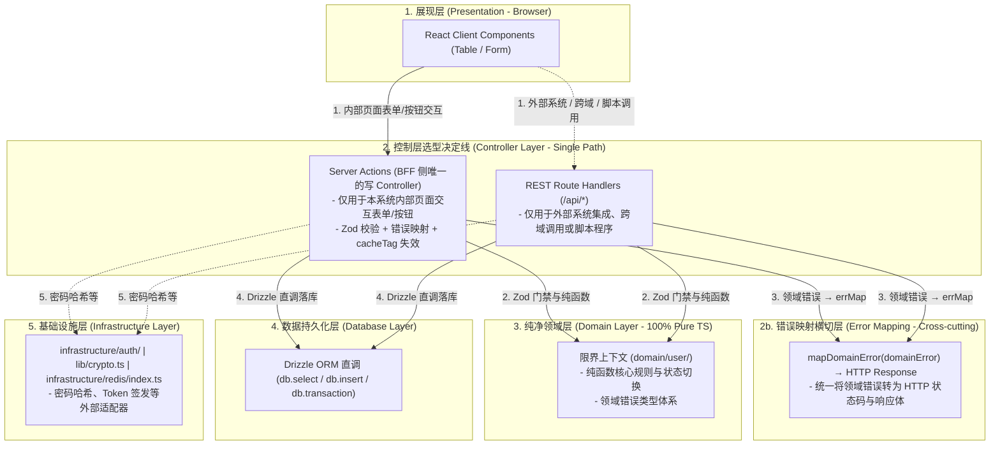

# Portal 架构设计与开发规范指南 (Zod门禁 + 领域纯函数 + Drizzle直调)

本指南旨在规范 `@auth-sso/portal` 项目在 Next.js 16 App Router + React 19 + Node.js 26 架构下的设计与重构标准，并完全对齐 [@portal-ddd-architecture-requirements.md](file:///Users/liushuo/code/干了科技/auth-sso/docs/brainstorms/portal-ddd-architecture-requirements.md) 需求文档。

> **版本演进说明**：本指南已针对 Next.js 16 的关键变化完成修订——包括 Cache Components（`use cache` 指令替代 `React.cache()`）、Middleware 更名为 Proxy、Server Functions 安全模型等。

---

## 一、 系统拓扑与单控制器技术选型边界 (Single Controller)

为了实现全栈同构架构下的**"极致轻量"**与**"单一真相源"**，我们明确禁止对同一个写操作同时编写两套控制器（如既写 Server Action 又写 REST API 路由）。控制层必须遵循以下技术选型矩阵进行单控制器决策：



### 核心分层职责：
1.  **读模型 (Read Model)**：Page 路由 (Server Component) 提取 URL `searchParams`，在数据拉取辅助器（`data.ts`）中直接通过 Drizzle SQL 获取扁平的数据对象，同步直传渲染，不经过 Domain 层包装，追求极致性能。
    *   **Next.js 16 缓存策略**：默认使用 `"use cache"` 指令 + `cacheLife()` 进行持久化缓存（跨请求复用），配合 `cacheTag()` 标签化失效。`React.cache()` 仅在未开启 `cacheComponents` 配置时作为降级方案（仅单次渲染周期去重）。
2.  **写模型 (Write Model - 单控制器原则)**：
    *   **判定标准**：如果一个写业务仅在我们自己内部的页面上调用，**一律只编写 Server Actions (actions.ts)**。严禁为其编写任何重复的 `/api/` 路由接口。
    *   **适用场景**：
        *   **Server Actions**：用于我们自己内部页面的表单提交、按钮点击、删除等操作，直接处理入参 Zod 解析，调用领域纯函数，直调 Drizzle 落库，并通过 `updateTag()` / `revalidatePath()` 刷新缓存，返回 JS plain object 即可。
        *   **REST Route Handlers**：只有在发生**”外部系统集成（Webhook/OIDC 回调）”**、**”跨域/子系统用户同步等开放 API 服务”**以及**”运维脚本与 cron 程序化调用”**这 3 种情况时，才允许为相应的写操作编写 API 路由。
    *   **统一规范**：所有控制层函数体**不超过 20 行，不包含一行业务逻辑判断**。
3.  **领域层 (Domain Layer)**：纯原生 TS 代码，零依赖 Next.js 模块。将所有核心业务规则（状态机转换、权限判定、数据计算与变换）抽象为**纯函数**（Plain Object 输入输出）。错误用**领域级错误类型**表达，由统一的**错误映射横切层**（`mapDomainError`）转换为 HTTP 响应。
4.  **数据持久化层 (Database Layer)**：不设置 Repository 接口与实现分离，不设 Mapper 转换层与工厂 DI。控制器层在通过 Zod 校验与领域函数处理后，直接调用 Drizzle 语句对数据库进行操作，直接引用由 Drizzle schema 推导出的物理类型，消除不必要的间接抽象层。涉及多表写入时必须在 Controller 层显式使用 `db.transaction()`。
5.  **基础设施层 (Infrastructure Layer)**：存放数据库连接、Redis 客户端、密码哈希等**有外部副作用的适配器**。`infrastructure/db/` 和 `infrastructure/redis/` 提供全局单例连接。区别于 `lib/`（纯业务工具与鉴权逻辑）。

---

## 二、 物理目录结构规范

重构与新建限界上下文 (Bounded Contexts) 时，应当严格按照以下路径划分职责，保持代码极致扁平，消除过度分层：

```
src/
├── app/users/                  # 1. 表现与应用层 (与 Next.js 强相关)
│   ├── page.tsx                #   - 路由直出入口 (Server Component 读模型)
│   ├── data.ts                 #   - 【读模型统一入口】所有 SELECT 查询集中于此（不含 'use server'）
│   │                           #     列表查询用 'use cache' + cacheTag，详情查询不缓存
│   ├── actions.ts              #   - 【写模型】仅 CUD Server Actions ('use server' + withAuth)
│   │                           #     禁止只读查询，禁止手写鉴权
│   ├── components/             #   - 客户端组件（表单、表格等）
│   └── (api/) route.ts         #   - REST API：GET 委托 data.ts，POST/PUT/DELETE 直接处理
│
├── domain/                     # 2. 纯净领域层 (零依赖 Next.js / Drizzle)
│   ├── shared/                 #   - 跨 BC 共享定义
│   │   ├── errors.ts           #     * 领域级错误类型体系 (DomainError)
│   │   ├── error-mapping.ts    #     * 错误 → HTTP 状态码映射 (横切关注点)
│   │   ├── zod-schemas.ts      #     * Zod 枚举 Schema 集中导出（所有 domain/*/types.ts 从此导入）
│   │   └── tree-utils.ts       #     * 泛型树构建工具（消除 buildMenuTree/buildDepartmentTree 重复）
│   └── user/                   #   - 聚合根 BC 有界上下文
│       ├── types.ts            #     * Zod Schema 校验 + TS 类型定义
│       └── user.ts             #     * 聚合根纯函数 (状态机、业务逻辑计算)
│                                #     * 含 toDomainXxx / xxxToInsertRow / xxxToUpdateRow 转换
│
├── infrastructure/             # 3. 基础设施层（有状态的连接/实例管理）
│   ├── auth/
│   │   └── auth-instance.ts    #   - (已移除，改用 domain/auth/token.ts 自实现 JWT 签发)
│   ├── db/index.ts             #   - Drizzle + postgres-js 数据库连接（全局单例）
│   └── redis/index.ts          #   - ioredis Redis 客户端（全局单例）
│
├── lib/                        # 4. 无状态共享工具与鉴权能力
│   ├── auth/                   #   - 鉴权模块（统一入口 + 子模块）
│   │   ├── index.ts            #     * 统一 Barrel（推荐引入点：import {...} from '@/lib/auth'）
│   │   ├── facade.ts           #     * withPermission + 子模块 re-export（API Route 用）
│   │   ├── guard.ts            #     * withAuth HOF（Server Action 用）
│   │   ├── client.ts           #     * 浏览器端 OAuth 客户端 + PKCE 工具
│   │   ├── verify-jwt.ts       #     * JWT/Session 身份验证
│   │   ├── check-permission.ts #     * 权限编码/角色检查（通过 lib/permissions 查 DB）
│   │   └── data-scope.ts       #     * 数据范围过滤（通过 lib/permissions 查 DB）
│   ├── session/                #   - JWT/Session 模块（按职责拆分为子模块）
│   │   ├── index.ts            #     * 统一 Barrel
│   │   ├── types.ts            #     * Cookie 常量 + PortalJwtClaims
│   │   ├── cookies.ts          #     * Cookie 读写 (setJwtCookies / getJwtFromCookie)
│   │   ├── jwks.ts             #     * JWKS 远端公钥集
│   │   ├── jwt.ts              #     * JWT 验签 (verifyJwt) + 解码 (decodeJwtPayload)
│   │   └── revoke.ts           #     * jti 黑名单紧急撤销
│   ├── permissions.ts          #   - 权限上下文查询与缓存（使用 infra 连接，不管理连接）
│   ├── audit.ts                #   - 审计日志入库（使用 infra 连接，不管理连接）
│   ├── crypto.ts               #   - 安全工具（ID/ClientId/Secret 生成）
│   ├── password.ts             #   - 密码哈希（bcrypt 封装，与 crypto.ts 同质）
│   └── utils.ts                #   - cn() CSS 类名合并
└── db/                         # 5. 物理存储定义（Schema + 查询模式）
    ├── schema.ts               #   - 表定义 + pgEnum
    ├── types.ts                #   - Drizzle $inferSelect / $inferInsert
    └── user-queries.ts         #   - 用户列表共享查询列选择 + 条件构建（schema 感知，不执行查询）
```

### 2.1 类型单一真相源：消除 Zod / Drizzle / TS 三层重复

当前架构中，同一枚举（如 `UserStatus`）在 `contracts`、`domain/types.ts`（Zod）、`domain/types.ts`（TS type）、`db/schema.ts`（Drizzle pgEnum）四个位置各自手写定义，字段名在 `UserPropsSchema` 和 Drizzle `users` 表之间重复声明。修改一个字段需要同步 3-4 处，极易漂移。

**强制规范：枚举值数组是唯一真相源，Zod 和 Drizzle 均从同一数组派生。**

```
@auth-sso/contracts (零依赖纯 TS 包)          ← 唯一真相源
  └── USER_STATUS_VALUES = ['ACTIVE', 'DISABLED', 'LOCKED', 'DELETED'] as const
  └── type UserStatus = typeof USER_STATUS_VALUES[number]        ← 自动推导，永不同步

domain/user/types.ts                          ← 领域层 Input Schema + 领域接口
  └── import { USER_STATUS_VALUES } from '@auth-sso/contracts'
  └── z.enum(USER_STATUS_VALUES)              ← 从数组派生，不手写字面量
  └── interface User { ... }                  ← 纯 TS 接口，不绑 Zod

db/schema.ts                                  ← 物理存储
  └── import { USER_STATUS_VALUES } from '@auth-sso/contracts'
  └── pgEnum('user_status', USER_STATUS_VALUES) ← 同一数组

编译期类型守卫                                  ← 防止 interface 与 Drizzle 漂移
  └── UserRow extends User ? ✅ : ❌
```

**关键决策：废除 `UserPropsSchema`。** 该 Schema 既不用于输入校验（那是 `CreateUserInputSchema` 的职责），也不用于 DB 操作（那是 Drizzle `$inferSelect` 的职责），仅仅是字段名的第三次手写。Domain 层改用纯 `interface User`，由编译期类型守卫保证与 Drizzle schema 同步。

其他规范保持不变：
1. **直接引用 Drizzle 物理模型**：在表现层、读路径及数据操作中，直接使用 `typeof schema.users.$inferSelect` / `$inferInsert` 作为 DB 行类型，避免手写重复的 DTO 或 DB 行接口。
2. **Zod 入参门禁推导**：所有外部输入过 Zod Schema 校验，通过 `z.infer<typeof CreateUserInputSchema>` 自动生成类型，直接用作领域函数输入。
3. **消除 Branded Types**：ID、状态等均直接使用 `string` 类型。依靠清晰的变量命名（如 `userId`、`deptId`）在当前项目规模下保证安全，减少由 `.brand()` 引入的类型强转和摩擦成本。

### 2.2 API 响应类型契约

为避免每个 Controller 返回结构不一致，应在 `contracts` 包中定义统一的响应泛型：

```typescript
// packages/contracts/src/api-types.ts

/** 成功响应 */
export type ApiSuccess<T> = {
  success: true;
  data: T;
  pagination?: { page: number; pageSize: number; total: number; totalPages: number };
};

/** 失败响应 */
export type ApiError = {
  success: false;
  error: string;   // 错误码（如 AUTH_SSO_3002）
  message: string; // 人类可读的错误描述
};

/** 统一 API 响应类型 */
export type ApiResponse<T> = ApiSuccess<T> | ApiError;
```

Server Action 返回 `ApiResponse<T>`，Route Handler 返回 `NextResponse.json(body, { status })`。所有控制器必须遵循此契约，前端可据此做类型安全的响应处理。

### 2.3 编译期类型同步守卫（Domain ↔ Drizzle 不漂移）

Domain 层的 `interface User` 和 Drizzle 的 `$inferSelect` 是同一实体的两种表达，必须保持字段兼容。在 `db/schema.ts` 底部放置编译期守卫：

```typescript
// db/schema.ts (底部)
import type { User } from '@/domain/user/types';
import type { UserStatus } from '@auth-sso/contracts';

type UserRow = typeof users.$inferSelect;

// 守卫 1：Drizzle 行类型必须兼容 Domain 实体（新增 DB 列时此处报错 → 提示更新 interface User）
type _UserRowCompatible = UserRow extends Omit<User, 'deptName'> ? true : never;
// deptName 是 JOIN 计算字段，非物理列，故排除

// 守卫 2：Drizzle 枚举值必须与 contracts 常值数组对齐（编译期穷举检查）
type _UserStatusInRow = UserRow['status'] extends UserStatus ? true : never;
type _UserStatusInDomain = UserStatus extends UserRow['status'] ? true : never;
```

> **原则**：新增/删除/重命名数据库列时，守卫语句会编译报错，强制开发者同步更新 `domain/` 中的 interface 和 `contracts` 中的常值。类型漂移在 CI 阶段即被拦截。

### 2.4 DB 行转换函数约定（消除 Controller 层重复列映射）

每个领域聚合根模块必须提供两个纯转换函数，集中管理「领域实体 → Drizzle 列」映射，消除 API Route 和 Server Action 中重复手写的列名对照：

```typescript
// domain/client/client.ts

/** 将领域实体转为 Drizzle insert 行（仅用于创建路径） */
export function clientToInsertRow(c: Client) {
  return {
    id: c.id, publicId: c.publicId, name: c.name,
    clientId: c.clientId, clientSecret: c.clientSecret,
    redirectUrls: JSON.stringify(c.redirectUris),  // 领域数组 → DB JSON 字符串
    grantTypes: c.grantTypes, scopes: c.scopes,
    homepageUrl: c.homepageUrl, icon: c.logoUrl,   // 领域名 → DB 列名映射
    accessTokenTtl: c.accessTokenTtl, refreshTokenTtl: c.refreshTokenTtl,
    status: c.status, disabled: c.disabled, skipConsent: c.skipConsent,
    createdAt: new Date(), updatedAt: new Date(),   // Temporal → Date（仅此一处转换点）
  };
}

/** 将领域实体转为 Drizzle update 行（仅用于更新路径） */
export function clientToUpdateRow(c: Client) { /* 子集：不含 id/publicId/createdAt */ }
```

**强制规则**：
- Controller 层 `db.insert().values()` 必须调用 `xxxToInsertRow(entity)`，禁止手写列名映射
- Controller 层 `db.update().set()` 必须调用 `xxxToUpdateRow(entity)`，禁止手写列名映射
- 此函数属于领域层的「DB 适配」范畴，可引用 `Date`（DB 边界唯一例外）
- 命名格式：`{entityCamelCase}ToInsertRow` / `{entityCamelCase}ToUpdateRow`

> **价值**：当前 5 个聚合根（client/role/permission/department/menu）的 API Route 和 Server Action 中各有 10-15 行重复列映射代码。集中后 Controller 函数体从 20+ 行缩减至 ~12 行。

### 2.5 contracts 类型扩展约定（避免枚举值重复定义）

当 Portal 侧需要用比 `@auth-sso/contracts` 更丰富的类型时（如审计日志的登录事件类型比 contracts 的 `LoginEventType` 多了 `TOKEN_REFRESH`），**不得**在本地重新定义同名类型。应导入基础类型并以别名扩展：

```typescript
// lib/audit.ts  ✅ 正确做法
import { type LoginEventType as BaseLoginEventType } from '@auth-sso/contracts';

export type PortalLoginEventType =
  | BaseLoginEventType       // LOGIN_SUCCESS | LOGIN_FAILED | LOGOUT
  | 'TOKEN_REFRESH'
  | 'TOKEN_REFRESH_FAILED';
```

```typescript
// ❌ 错误做法：重复定义同名类型，与 contracts 脱钩
export type LoginEventType = 'LOGIN_SUCCESS' | 'LOGIN_FAILED' | ...;
```

---

## 三、 核心代码落地样例规范

### 3.1 第一步：`@auth-sso/contracts` 定义枚举常值（唯一真相源）

```typescript
// packages/contracts/src/constants.ts
export const USER_STATUS_VALUES = ['ACTIVE', 'DISABLED', 'LOCKED', 'DELETED'] as const;
export type UserStatus = typeof USER_STATUS_VALUES[number]; // 'ACTIVE' | 'DISABLED' | 'LOCKED' | 'DELETED'

export const ENTITY_STATUS_VALUES = ['ACTIVE', 'DISABLED'] as const;
export type EntityStatus = typeof ENTITY_STATUS_VALUES[number];
```

### 3.1b 第二步：领域层——纯 TS 接口 + Zod 入参门禁（不重复定义枚举值）

```typescript
// domain/user/types.ts
import { z } from 'zod';
import { USER_STATUS_VALUES, type UserStatus } from '@auth-sso/contracts';

// ── 领域实体（纯 TS interface，替代旧的 UserPropsSchema） ──
export interface User {
  id: string;
  publicId: string;
  username: string;
  email: string | null;
  name: string;
  status: UserStatus;
  deptId: string | null;
  deptName: string | null;       // JOIN 计算字段，非物理列
  createdAt: Date;
}

// ── Zod 枚举从 contracts 常值数组派生（不手写字面量） ──
const userStatusEnum = z.enum(USER_STATUS_VALUES);

// ── 入参门禁 Schema（仅外部输入，不包含内部字段如 id / createdAt） ──
export const CreateUserInputSchema = z.object({
  name: z.string().min(1, '姓名不能为空'),
  username: z.string().min(3, '用户名至少3位'),
  email: z.string().email('邮箱格式不合法'),
  password: z.string().min(6, '密码至少6位'),
  deptId: z.string().optional().nullable(),
});
export type CreateUserInput = z.infer<typeof CreateUserInputSchema>;

export const UpdateUserInputSchema = z.object({
  id: z.string().min(1),
  name: z.string().min(1).optional(),
  email: z.string().email().optional(),
  status: userStatusEnum.optional(),            // ← 复用，非内联字面量
  deptId: z.string().nullable().optional(),
  avatarUrl: z.string().optional(),
});
export type UpdateUserInput = z.infer<typeof UpdateUserInputSchema>;
```

### 3.1c 第三步：Drizzle Schema 也从同一常值数组派生

```typescript
// db/schema.ts
import { USER_STATUS_VALUES, ENTITY_STATUS_VALUES } from '@auth-sso/contracts';

export const userStatusEnum = pgEnum('user_status', USER_STATUS_VALUES as [string, ...string[]]);
export const entityStatusEnum = pgEnum('entity_status', ENTITY_STATUS_VALUES as [string, ...string[]]);
```

> **强制规则**：任何枚举的合法值集合只在 `@auth-sso/contracts` 中定义一次。Zod 的 `z.enum()` 和 Drizzle 的 `pgEnum()` 均从 contracts 导出的常值数组派生，严禁在 domain/ 或 db/ 中手写枚举字面量。

### 3.2 领域层：错误类型体系 (domain/shared/errors.ts)

领域层使用**结构化错误类型**替代裸 `throw new Error()`，以便 Controller 精确映射 HTTP 状态码，且单元测试中易于断言：

```typescript
// domain/shared/errors.ts

/**
 * 领域错误基类
 */
export class DomainError extends Error {
  constructor(public readonly code: string, message: string) {
    super(message);
    this.name = this.constructor.name;
  }
}

export class EntityNotFoundError extends DomainError {
  constructor(entity: string, id: string) {
    super('ENTITY_NOT_FOUND', `${entity} [${id}] 不存在`);
  }
}

export class BusinessRuleViolationError extends DomainError {
  constructor(rule: string) {
    super('BUSINESS_RULE_VIOLATION', rule);
  }
}

export class DuplicateEntityError extends DomainError {
  constructor(entity: string, field: string) {
    super('DUPLICATE_ENTITY', `${entity} 的 ${field} 已存在`);
  }
}
```

### 3.2b 错误映射横切层 (domain/shared/error-mapping.ts)

Controller 不手写 `if (err instanceof DuplicateEntityError)` 分支，而是通过统一的映射函数将领域错误转为 HTTP 响应。这是防腐的关键关口：

```typescript
// domain/shared/error-mapping.ts
import { DomainError, EntityNotFoundError, BusinessRuleViolationError, DuplicateEntityError } from './errors';

/** 错误映射结果 */
export interface ErrorMapping {
  status: number;
  error: string;   // 错误码
  message: string;
}

/** 将领域错误统一映射为 HTTP 语义 */
export function mapDomainError(err: unknown): ErrorMapping {
  if (err instanceof EntityNotFoundError) {
    return { status: 404, error: err.code, message: err.message };
  }
  if (err instanceof DuplicateEntityError) {
    return { status: 409, error: err.code, message: err.message };
  }
  if (err instanceof BusinessRuleViolationError) {
    return { status: 422, error: err.code, message: err.message };
  }
  if (err instanceof DomainError) {
    return { status: 400, error: err.code, message: err.message };
  }
  // 未知异常统一 500
  console.error('[mapDomainError] 未预期的异常:', err);
  return { status: 500, error: 'INTERNAL_ERROR', message: '服务器内部错误' };
}
```

Controller 层统一调用 `mapDomainError(err)` 生成响应，消除各 Controller 中的 ad-hoc 错误处理分支。

### 3.3 领域层：聚合根纯函数 (domain/user/user.ts)

聚合根模块包含纯行为函数，输入输出为 Plain Object，不依赖任何数据库和外部框架，便于秒级单测：

```typescript
// domain/user/user.ts
import { UserProps, CreateUserInput } from './types';
import { BusinessRuleViolationError } from '../shared/errors';

export interface User extends UserProps {}

/**
 * 领域纯函数：构建新用户初始对象 (无副作用)
 */
export function createUser(
  input: CreateUserInput,
  idGenerator: (len: number) => string
): User {
  return {
    id: idGenerator(20),
    publicId: `user_${idGenerator(8)}`,
    username: input.username,
    email: input.email,
    name: input.name,
    status: 'ACTIVE',
    deptId: input.deptId || null,
    deptName: null,
    createdAt: new Date(),
  };
}

/**
 * 领域纯函数：状态机切换规则 (无副作用)
 */
export function toggleUserStatus(user: User): User {
  if (user.status === 'DELETED') {
    throw new BusinessRuleViolationError('已逻辑删除的用户无法操作状态');
  }
  const newStatus: User['status'] = user.status === 'ACTIVE' ? 'DISABLED' : 'ACTIVE';
  return { ...user, status: newStatus };
}

/**
 * 领域纯函数：逻辑删除用户 (无副作用)
 * 包含删除前置条件检查——Controller 不应自行判断能否删除
 */
export function deleteUser(user: User): User {
  if (user.status === 'DELETED') {
    throw new BusinessRuleViolationError('用户已被删除，不可重复操作');
  }
  return { ...user, status: 'DELETED' as const };
}

/**
 * 领域纯函数：构建更新后的用户对象 (无副作用)
 * 将字段 merge 策略从 Controller 中下沉，消除 Controller 中的 ?? 链
 */
export function applyUserUpdate(user: User, patch: Partial<Pick<User, 'name' | 'email' | 'status' | 'deptId' | 'avatarUrl'>>): User {
  if (user.status === 'DELETED') {
    throw new BusinessRuleViolationError('无法更新已逻辑删除的用户');
  }
  return {
    ...user,
    name: patch.name ?? user.name,
    email: patch.email ?? user.email,
    status: patch.status ?? user.status,
    deptId: patch.deptId !== undefined ? patch.deptId : user.deptId,
    avatarUrl: 'avatarUrl' in patch ? (patch.avatarUrl ?? null) : user.avatarUrl,
  };
}
```

### 3.4 表现层：薄 Controller 规范 (actions.ts / route.ts)

表现层直接执行 **Zod 校验门禁 -> 调用领域纯函数判断 -> Drizzle 数据库直调**。函数体 **≤ 20 行**。统一使用 `mapDomainError` 转换领域错误。

```typescript
// app/users/actions.ts (Server Actions Controller)
'use server';

import { revalidatePath } from 'next/cache';
import { headers } from 'next/headers';
import { checkPermission } from '@/lib/auth';
import { db } from '@/infrastructure/db';
import { users } from '@/infrastructure/db/schema';
import { eq, or } from 'drizzle-orm';
import { createUser } from '@/domain/user/user';
import { CreateUserInputSchema } from '@/domain/user/types';
import { generateId } from '@/lib/crypto';
import { hashPassword } from '@/infrastructure/auth/password-service';
import { DuplicateEntityError } from '@/domain/shared/errors';
import { mapDomainError } from '@/domain/shared/error-mapping';

export async function createUserAction(prevState: any, formData: FormData) {
  const check = await checkPermission(await headers(), { permissions: ['user:create'] });
  if (!check.authorized) return { success: false, error: 'FORBIDDEN', message: '权限不足' };

  const parsed = CreateUserInputSchema.safeParse(Object.fromEntries(formData));
  if (!parsed.success) return { success: false, error: 'VALIDATION_ERROR', message: parsed.error.issues[0].message };

  try {
    // 涉及"查重 + 插入"两个步骤，使用事务保证一致性
    const result = await db.transaction(async (tx) => {
      const existing = await tx.query.users.findFirst({
        where: or(eq(users.username, parsed.data.username), eq(users.email, parsed.data.email))
      });
      if (existing) throw new DuplicateEntityError('User', 'username/email');

      const user = createUser(parsed.data, generateId);
      const passwordHash = await hashPassword(parsed.data.password);
      await tx.insert(users).values({ ...user, passwordHash });
      return user;
    });

    revalidatePath('/users');
    return { success: true, data: { id: result.publicId }, message: '用户创建成功' };
  } catch (err: unknown) {
    const mapped = mapDomainError(err);
    return { success: false, error: mapped.error, message: mapped.message };
  }
}
```

### 3.5 表现层：REST Route Handler 薄 Controller 示例 (route.ts)

```typescript
// app/api/users/route.ts (REST API Route Handler)
import { NextRequest, NextResponse } from 'next/server';
import { checkPermission } from '@/lib/auth';
import { db } from '@/infrastructure/db';
import { users } from '@/infrastructure/db/schema';
import { eq, or } from 'drizzle-orm';
import { createUser } from '@/domain/user/user';
import { CreateUserInputSchema } from '@/domain/user/types';
import { generateId } from '@/lib/crypto';
import { hashPassword } from '@/infrastructure/auth/password-service';
import { DuplicateEntityError } from '@/domain/shared/errors';
import { mapDomainError } from '@/domain/shared/error-mapping';

export async function POST(req: NextRequest) {
  const check = await checkPermission(req.headers, { permissions: ['user:create'] });
  if (!check.authorized) return NextResponse.json({ error: check.error, message: '权限不足' }, { status: 403 });

  const parsed = CreateUserInputSchema.safeParse(await req.json());
  if (!parsed.success) return NextResponse.json({ error: 'VALIDATION_ERROR', message: parsed.error.issues[0].message }, { status: 400 });

  try {
    const result = await db.transaction(async (tx) => {
      const existing = await tx.query.users.findFirst({
        where: or(eq(users.username, parsed.data.username), eq(users.email, parsed.data.email))
      });
      if (existing) throw new DuplicateEntityError('User', 'username/email');

      const user = createUser(parsed.data, generateId);
      const passwordHash = await hashPassword(parsed.data.password);
      await tx.insert(users).values({ ...user, passwordHash });
      return user;
    });

    return NextResponse.json({ data: { id: result.publicId } }, { status: 201 });
  } catch (err: unknown) {
    const mapped = mapDomainError(err);
    return NextResponse.json({ error: mapped.error, message: mapped.message }, { status: mapped.status });
  }
}
```

### 3.6 读路径：`use cache` 持久化缓存（Next.js 16 推荐）

Next.js 16 启用 `cacheComponents: true` 后，使用 `"use cache"` 指令替代 `React.cache()`：
- `React.cache()` 仅在单次渲染周期内去重（请求级别），不跨请求复用
- `"use cache"` 持久化缓存跨请求复用，配合 `cacheLife()` / `cacheTag()` 精细控制

```typescript
// app/users/data.ts
import { cacheLife, cacheTag } from 'next/cache';
import { db } from '@/infrastructure/db';
import { checkPermission, getDataScopeFilter, applyDataScopeFilter } from '@/lib/auth';
import { headers } from 'next/headers';

export async function getUsers(params: {
  page: number; pageSize: number; keyword: string; status: string;
}) {
  'use cache';
  cacheLife('minutes');          // 缓存生命周期：分钟级
  cacheTag('users-list');        // 标签化，后续可通过 updateTag('users-list') 精确失效

  const check = await checkPermission(await headers(), { permissions: ['user:list'] });
  if (!check.authorized || !check.userId) throw new Error('权限不足');

  const scopeFilter = await getDataScopeFilter(check.userId);
  // applyDataScopeFilter 是抽取的公共工具函数，消除各读路径中的重复分支
  const conditions = applyDataScopeFilter(scopeFilter, check.userId);

  // ... Drizzle 直接进行查询
}
```

> **降级方案**：若未开启 `cacheComponents`，继续使用 `React.cache()` 作为请求级去重。但强烈建议迁移至 Cache Components 以获得更好的性能与更清晰的失效语义。

---

## 四、 单元测试与 TDD

只在不依赖任何框架的 `domain/` 下高频推行 TDD：

```typescript
// __tests__/domain/user.test.ts
import { describe, it, expect } from 'vitest';
import { toggleUserStatus, createUser } from '@/domain/user/user';
import { BusinessRuleViolationError } from '@/domain/shared/errors';

describe('User 领域核心规则 TDD 测试', () => {
  it('应通过工厂函数创建初始状态为 ACTIVE 的用户', () => {
    const input = { name: '测试', username: 'test', email: 'a@a.com', password: '123456' };
    const user = createUser(input, () => 'generated_id');
    expect(user.status).toBe('ACTIVE');
  });

  it('当激活态用户切换状态时，应变为禁用状态', () => {
    const user = {
      id: 'u_1', publicId: 'user_1', username: 'test', email: 'a@a.com', name: '测试',
      status: 'ACTIVE' as const, deptId: null, deptName: null, createdAt: new Date()
    };
    expect(toggleUserStatus(user).status).toBe('DISABLED');
  });

  it('当删除态用户切换状态时，应抛出 BusinessRuleViolationError', () => {
    const user = {
      id: 'u_1', publicId: 'user_1', username: 'test', email: 'a@a.com', name: '测试',
      status: 'DELETED' as const, deptId: null, deptName: null, createdAt: new Date()
    };
    expect(() => toggleUserStatus(user)).toThrow(BusinessRuleViolationError);
  });
});
```

---

## 五、 架构边界自动化守护

使用 `eslint-plugin-boundaries` 强制层间依赖方向，将架构约束作为 **CI 级硬拦截**：

```javascript
// eslint.config.js (architecture boundary rules)
import boundaries from 'eslint-plugin-boundaries';

export default [
  {
    plugins: { boundaries },
    settings: {
      'boundaries/elements': [
        { type: 'domain',          pattern: ['src/domain/*'] },
        { type: 'app',             pattern: ['src/app/*'] },
        { type: 'lib',             pattern: ['src/lib/*'] },
        { type: 'infrastructure',  pattern: ['src/infrastructure/*'] },
      ]
    },
    rules: {
      'boundaries/element-types': [2, {
        default: 'disallow',
        rules: [
          // 领域层：只能 import 领域层自身，零外部依赖
          { from: 'domain', allow: ['domain'] },
          // 基础设施层：可依赖 lib 和 domain，不可依赖 app
          { from: 'infrastructure', allow: ['infrastructure', 'lib', 'domain'] },
          // 共享工具层：可依赖 domain、lib 自身、infrastructure（使用已建立的连接）
          { from: 'lib', allow: ['lib', 'domain', 'infrastructure'] },
          // 表现层：可依赖所有层
          { from: 'app', allow: ['domain', 'lib', 'infrastructure', 'app'] },
        ]
      }],
      // Controller 函数体行数限制
      'max-lines-per-function': ['warn', {
        max: 25,
        skipBlankLines: true,
        skipComments: true
      }],
    }
  }
];
```

### 导入允许矩阵

| 源层 → 目标层 | domain | lib | infrastructure | app |
| :--- | :---: | :---: | :---: | :---: |
| **domain** | ✅ | ❌ | ❌ | ❌ |
| **lib** | ✅ | ✅ | ✅ | ❌ |
| **infrastructure** | ✅ | ✅ | ✅ | ❌ |
| **app** | ✅ | ✅ | ✅ | ✅ |

---

## 六、 命名与物理边界约束表

| 文件类别 | 物理命名格式 | 允许导入的依赖 | 职责限制 | 自动化守护 |
| :--- | :--- | :--- | :--- | :--- |
| **首屏拉取** | `page.tsx` | 展示子组件, `data.ts` | 读模型入口，严禁写操作 | — |
| **数据直调** | `data.ts` | `drizzle-orm`, `next/headers`, `next/cache` (`cacheLife`/`cacheTag`) | Drizzle 数据直接查询，使用 `"use cache"` 持久化缓存，绕过领域层直取只读数据 | — |
| **Client Component 表单** | `components/*/Form.tsx` | `react-dom`, Server Actions | 必须使用 `useFormStatus` 或 `useActionState` 防止重复提交 | — |
| **Server Action** | `actions.ts` | `next/cache`, `domain/`, `lib/auth` (`withAuth`), `infrastructure/db` | **≤ 20 行**，Zod `.safeParse()` 校验入参，`xxxToInsertRow()` 统一 DB 映射，Drizzle 直调 + 事务 | `max-lines-per-function` |
| **API 路由** | `route.ts` | `next/server`, `domain/`, `lib/auth` (`withPermission`), `infrastructure/db` | REST 写网关，约束同上。使用 `withPermission()` 包装 | `max-lines-per-function` |
| **领域层核心** | `domain/*/*.ts` | **仅限 `@auth-sso/contracts` + Zod + 纯 TypeScript** | 纯函数计算 + `xxxToInsertRow`/`xxxToUpdateRow` DB 行转换。枚举值必须从 contracts 导入 | `boundaries/element-types` |
| **领域实体接口** | `domain/*/types.ts` | 纯 TS `interface`，`zod` | 替代旧 `UserPropsSchema`。Interface 不绑 Zod，仅描述实体结构。与 Drizzle `$inferSelect` 的兼容性由编译期守卫保证 | — |
| **领域错误** | `domain/shared/errors.ts` | 仅限纯 TypeScript | DomainError 基类及子类 | `boundaries/element-types` |
| **错误映射** | `domain/shared/error-mapping.ts` | `domain/shared/errors.ts` | 领域错误 → HTTP 状态码映射，Controller 唯一错误处理入口 | `boundaries/element-types` |
| **Zod Schema 共享** | `domain/shared/zod-schemas.ts` | `@auth-sso/contracts`, `zod` | 所有 Zod 枚举 Schema 集中导出。domain/*/types.ts 从此文件导入，禁止在各 domain 中手写 `z.enum()` | — |
| **泛型树工具** | `domain/shared/tree-utils.ts` | 仅限纯 TypeScript | `buildTree<T>()` 泛型树构建函数。`buildMenuTree`/`buildDepartmentTree` 均委托至此 | — |
| **权限上下文** | `lib/permissions.ts` | `infrastructure/db`, `infrastructure/redis` | 用户权限上下文获取与缓存（无状态——使用 infra 提供的连接，不管理连接生命周期） | — |
| **审计日志** | `lib/audit.ts` | `infrastructure/db` | 审计日志入库与高阶装饰器（无状态——使用 infra 提供的连接） | — |
| **密码工具** | `lib/password.ts` | `bcryptjs` | 密码哈希（与 `lib/crypto.ts` 同质——无状态 crypto 工具） | — |
| **基础设施** | `infrastructure/*/index.ts` | `lib/`, `domain/`, 第三方 SDK | **有状态**的外部适配器（DB 连接、Redis 客户端）。区别于 lib/：这些模块管理连接/实例生命周期 | `boundaries/element-types` |
| **Auth 鉴权** | `lib/auth/*.ts` | `lib/permissions`, `lib/session`, `infrastructure/db` | 鉴权子模块。权限/角色检查使用 lib/ 中的工具和 infra 中的连接。推荐统一从 `@/lib/auth` 导入 | — |
| **Session/JWT** | `lib/session/*.ts` | `jose`, `infrastructure/redis` | JWT Cookie 读写、验签、jti 撤销。推荐统一从 `@/lib/session` 导入 | — |

---

## 七、 关键约束红线 (Code Review 一票否决)

以下违规在 Code Review 中**一票否决**，不得合入主干：

1. **领域层 import `next/*` 或任何外部框架依赖** —— 破坏零框架依赖原则。
2. **Controller/Action 中包含核心业务规则判断（如状态机逻辑、字段 merge 策略、`??` 链式默认值赋值）** —— 职责越界，必须下沉为纯函数。
3. **Controller/Action 函数体超过 25 行（含）** —— 违反薄 Controller 原则。
4. **Server Action 入参手动 `if (!field)` 判空而非 Zod 校验** —— 遗漏字段校验路径，必须使用 Zod 统一作为唯一门禁。
5. **领域层抛出 `throw new Error(...)` 而非领域错误类型** —— 丢失结构化错误语义。
6. **Controller 层手写 `if (err instanceof XxxError)` 而非使用 `mapDomainError`** —— 错误映射逻辑分散，破坏统一的错误处理横切层。
7. **涉及多表写入的 Controller 未使用 `db.transaction()` 包裹** —— 数据一致性风险。
8. **读路径中重复编写数据范围过滤分支（`if (scopeFilter.type === 'LIST')...`）** —— 必须使用统一的 `applyDataScopeFilter` 工具函数。
9. **`domain/` 或 `db/` 中手写枚举字面量（`z.enum(['ACTIVE',...])` / `pgEnum('...', ['ACTIVE',...])`）** —— 枚举值必须从 `@auth-sso/contracts` 常值数组派生，单一真相源。
10. **`domain/` 中保留 `XxxPropsSchema`（如 `UserPropsSchema`）** —— 已废除。Domain 实体用纯 `interface`，不再用 Zod Schema 描述实体全貌。
11. **API Route GET 处理器中出现直接 `db.select()` / `db.query` DB 调用** —— 读操作必须委托给 `data.ts` 统一读模型，Route 只做鉴权 + 委托。
12. **`actions.ts` 中存在只读查询函数（如 `getXxxAction`）** —— `actions.ts` 仅保留 CUD 写操作，读归 `data.ts`。
13. **写操作只调 `revalidatePath` 未调 `revalidateTag`** —— 缓存失效不完整，必须双写失效：`revalidatePath('/xxx')` + `revalidateTag('xxx-list', 'minutes')`。
14. **`data.ts` 函数使用 `db.query.xxx.findFirst()`** —— 统一使用 `db.select().from().where().limit(1)` 风格，保证测试 mock 兼容性。

---

## 八、 Server Action / Server Function 安全基线

以下为 Server Action 与 API 路由的安全底线要求，所有写操作必须满足。采用 **Gateway 验签 + Proxy CSRF + Action 精细鉴权** 的三层防御模型：

```
┌──────────────────────────────────────────────────────────────────┐
│ 第一层：Gateway (Rust/Pingora 边缘网关)                            │
│ • ES256 JWKS 离线 JWT 验签（签名 + 过期 + issuer）                 │
│ • Cookie → Bearer Token 转换（剥离 Cookie，注入 Authorization）    │
│ • 拒绝无有效 JWT 的请求（401）                                     │
│ ⚠ 不查 DB/Redis，不做权限编码校验                                  │
│ ⚠ 不查 JWT claims 中的 permissions（时效性问题，见下文）            │
└──────────────────────────┬───────────────────────────────────────┘
                           ▼
┌──────────────────────────────────────────────────────────────────┐
│ 第二层：Proxy (Next.js 边缘乐观检查)                               │
│ • Origin/Referer CSRF 校验（写操作）                               │
│ • 本地开发兜底：无 Gateway 时不做额外校验（由 Portal Action 层负责）  │
│ ⚠ 运行在 Edge Runtime，不可访问 Drizzle/DB                         │
└──────────────────────────┬───────────────────────────────────────┘
                           ▼
┌──────────────────────────────────────────────────────────────────┐
│ 第三层：withAuth Guard (Portal 应用精细鉴权)                        │
│ • 细粒度权限编码校验（user:create 等）——实时查询 DB + Redis 缓存    │
│ • 数据范围/资源所有权校验（含递归 CTE 部门树）                       │
│ • 领域错误统一映射（mapDomainError）                                │
│ ✅ 运行在 Node.js Runtime，完整访问 Drizzle/DB/Redis               │
└──────────────────────────────────────────────────────────────────┘
```

### 为什么 Gateway 不做权限编码校验？

Gateway 已经解码了 JWT，JWT claims 中也确实包含 `permissions` 和 `roles`。**技术上可行，但安全上不可靠**：

| 方式 | 权限生效延迟 | 数据范围 | jti 撤销 |
|------|-------------|---------|---------|
| Gateway 读 JWT claims 做权限检查 | **最长 1h**（Token 过期才刷新） | ❌ 无法做（需递归 CTE） | ❌ 无 Redis |
| Portal Action 查 DB 做权限检查 | **最长 5min**（Redis 缓存 TTL） | ✅ `checkDataScope()` | ✅ `isJtiRevoked()` |

管理后台的权限变更（如管理员撤销某用户的删除权限）需要尽快生效。依赖 JWT claims 意味着攻击窗口 = Token 剩余有效期。因此，**权限检查必须在 Portal Action 层实时查 DB**，Gateway 仅负责"这个请求带了一个有效 JWT 吗"的身份校验。

> **例外**：如果系统接受 1h 的权限变更延迟，可以将 Gateway 的 Claims struct 扩展为包含 `permissions` 字段做粗粒度角色门禁（如"非 admin 角色拒绝访问 /api/admin/*"）。这是一种性能优化（减少抵达 Portal 的无效请求），**但不能替代** Action 层的精细鉴权。

### 8.1 第一层：Gateway（Rust/Pingora，离线 JWT 验签 + Cookie→Bearer 转换）

Gateway 是系统的**最外层安全边界**，运行在 Rust/Pingora 上，性能极高。它不访问 DB/Redis，只做纯 CPU 的 JWT 离线验签：

```
请求进入 → Gateway 提取 Cookie 中的 portal_jwt_token
         → 从内存 JWKS 缓存取 ES256 公钥（每 5min 自动刷新）
         → 本地验签（签名 + 过期 + issuer）
         → 通过：剥离 Cookie，注入 Authorization: Bearer <JWT>，转发给 Portal
         → 失败：直接返回 401
```

Gateway 代码位于 `apps/gateway/src/main.rs`，核心逻辑已在 `request_filter` 中实现。**不在此处扩展权限检查**的原因见上文时效性分析。

### 8.2 第二层：Proxy（CSRF + 兜底检查）

Gateway 承担了主要的身份验证工作后，Proxy 的职责简化为 CSRF 保护：

```typescript
// proxy.ts
import { NextResponse } from 'next/server';
import type { NextRequest } from 'next/server';

export function proxy(request: NextRequest) {
  // CSRF：写操作校验 Origin（防止跨站伪造）
  if (request.method !== 'GET' && request.method !== 'HEAD') {
    const origin = request.headers.get('origin');
    const host = request.headers.get('host');
    if (origin && host && !origin.endsWith(host)) {
      return NextResponse.json({ error: 'CSRF_INVALID' }, { status: 403 });
    }
  }
  // 身份验证已由 Gateway 完成，Proxy 不做重复工作
}
```

> **注意**：本地开发环境（无 Gateway）时，Portal 自身通过 `verifyAccessToken`（domain/auth/token.ts）完成 JWT 身份验证。JWT 签发使用 DB 存储的 ES256 密钥对。Proxy 不需要兜底 JWT 检查——那是 Portal Action 层的职责。

### 8.3 第三层：withAuth Guard 精细鉴权

Server Action 层通过 `withAuth` 高阶函数统一施加鉴权，确保编译期无法跳过：

```typescript
// lib/auth/guard.ts
import { headers } from 'next/headers';
import { checkPermission, type PermissionCheckOptions } from './check-permission';
import { mapDomainError } from '@/domain/shared/error-mapping';

export function withAuth<T extends (...args: any[]) => Promise<any>>(
  options: PermissionCheckOptions,
  fn: T
): T {
  return (async (...args: any[]) => {
    // ← 此处可访问 Drizzle/DB，做完整的权限编码 + 角色 + 数据范围校验
    const check = await checkPermission(await headers(), options);
    if (!check.authorized) {
      return { success: false, error: check.error || 'FORBIDDEN', message: '权限不足' };
    }
    try {
      return await fn(...args);
    } catch (err) {
      const mapped = mapDomainError(err);
      return { success: false, error: mapped.error, message: mapped.message };
    }
  }) as T;
}
```

### 8.4 其他安全措施

1. **Server Function 公开可达性警告**：Next.js 16 的 Server Function 可通过直接 HTTP POST 请求调用，**不仅仅通过你的 UI**。这正是三层防御存在的理由——Gateway 拒绝无有效 JWT 的请求，Proxy 拦截 CSRF，`withAuth` 拦截无权限的合法登录用户。

2. **请求体大小限制**：在 `next.config.ts` 中配置 `serverActions.bodySizeLimit`，防止超大 payload 攻击：
   ```typescript
   // next.config.ts
   const nextConfig = {
     serverActions: {
       bodySizeLimit: '1mb',
     },
   };
   ```

3. **Session Cookie 安全策略**：Session Cookie 必须设置 `SameSite=Lax`（默认值），防止 CSRF 跨站提交。严禁降级为 `SameSite=None`（除非有明确的跨域 SSO 场景并配合 `Secure` 标志）。

4. **资源所有权校验（数据范围过滤）**：写操作除功能权限（如 `user:create`）外，**必须校验资源所有权**。例如：部门管理员只能操作本部门下的用户，不得仅凭功能权限即放行跨部门操作。所有数据库查询与写入必须通过统一的 `applyDataScopeFilter` / `checkDataScope` 附加数据范围过滤。

5. **环境变量安全**：不得在 `NEXT_PUBLIC_` 前缀的环境变量中暴露敏感信息（API 密钥、数据库连接串、JWT 密钥等）。`NEXT_PUBLIC_` 变量会被打包到客户端 bundle，对用户完全可见。

---

## 九、 极简架构的三个开发防线 (防腐关口)

为了防止去掉 Repository/Mapper 等重度抽象后，代码在后续迭代中退化为混乱的“泥潭”，所有全栈开发者必须严格坚守以下三条设计防线：

### 9.1 防线一：坚守“Controller 零业务规则判断”红线
Controller (Server Actions 和 Route Handlers) 必须只做**编排 (Orchestration)**，即：参数校验、读取、调用纯函数计算、写入、响应。
*   **严禁行为**：严禁在 Controller 内联条件分支处理业务逻辑（如 `if (user.status === 'DELETED')`）。
*   **正确做法**：核心的业务规则、状态转移、合法性判定必须封装在 Domain 纯函数中。Controller 捕获领域层抛出的结构化错误（如 `BusinessRuleViolationError`）来决定响应状态，绝对不自己做规则裁决。

### 9.2 防线二：显式处理 Controller 层的事务边界 (Transaction)
由于去掉了持久化层接口，涉及多表操作或多步骤的写入时，其事务边界显式暴露在 Controller 层。
*   **编写原则**：Controller 在进行涉及一致性的写操作时，必须通过 Drizzle 的 `db.transaction(async (tx) => { ... })` 显式包裹。
*   **依赖传递**：事务内所有的数据库操作均必须使用回调提供的 `tx` 实例，严禁混用全局 `db` 实例，确保操作的原子性与数据一致性。

### 9.3 防线三：读模型 (Read Model) 极速直调与去重
只读的查询路径（读模型）无需经过领域纯函数包裹，应直接利用 Drizzle 强大的零开销 SQL 抽象。
*   **性能守则**：读模型利用 Drizzle schema 进行多表 Join、扁平化筛选和分页。
*   **Next.js 16 缓存守则**：
    *   默认使用 `"use cache"` + `cacheLife()` 实现跨请求持久化缓存。配合 `cacheTag()` 标签化，写操作通过 `updateTag()` 精确失效。
    *   未开启 `cacheComponents` 时，降级使用 `React.cache()` 实现请求级去重。

### 9.4 防线四：领域错误唯一映射出口 (mapDomainError)
Controller 只捕获错误，不判断错误类型。所有 `DomainError` → HTTP Status 的映射逻辑集中在 `domain/shared/error-mapping.ts` 中的 `mapDomainError()` 函数。
*   **严禁行为**：Controller 中写 `if (err instanceof DuplicateEntityError) { return NextResponse.json(..., { status: 409 }) }`。
*   **正确做法**：Controller 的 catch 块只调用 `const mapped = mapDomainError(err); return NextResponse.json(mapped, { status: mapped.status })`。

### 9.5 防线五：数据范围过滤统一抽取 (applyDataScopeFilter)
`data.ts`、各 GET Route、各 BC 的读路径中**严禁**重复编写数据范围过滤的分支逻辑（`if (scopeFilter.type === 'LIST') { ... } else if (scopeFilter.type === 'SELF') { ... }`）。
*   **正确做法**：抽取 `applyDataScopeFilter(query, scopeFilter, userId)` 工具函数，所有读路径统一调用，消除代码重复并确保安全策略一致。

### 9.6 防线六：Auth Guard 包装器统一鉴权 (withAuth)

Server Action 中**严禁**各自手写 `checkPermission` + `mapDomainError` 样板代码。所有 Action 的鉴权与错误映射必须通过 `withAuth` 高阶函数统一处理。

```typescript
// lib/auth/guard.ts — Server Action 鉴权 HOF
export function withAuth(options, fn) {
  return async (...args) => {
    const check = await checkPermission(await headers(), options);
    if (!check.authorized) return { success: false, error: 'FORBIDDEN', ... };
    try { return await fn(...args); }
    catch (err) { return mapDomainError(err); }
  };
}
```

**推荐导入方式**：`import { withAuth } from '@/lib/auth'`（从 barrel 统一导入）。
**正确做法**：`export const myAction = withAuth({ permissions: ['x:create'] }, async (input) => { ... })`。
**严禁行为**：Action 函数体内出现 `const check = await checkPermission(...)` 或 `catch (err) { const mapped = mapDomainError(err) }`。

---

## 十、 React 19 组件模式规范

### 10.1 核心原则：各司其职

| 层 | 职责 | 甜点 |
|----|------|------|
| **Server Component** | 数据获取、只读渲染 | `async` 直取数据，零客户端 JS |
| **Client Component** | 交互状态管理 | `useState`/`useOptimistic`/`useTransition` |
| **Server Action** | 写操作 | `'use server'` 函数，可被 Client 直接调用 |

**Props 从 Server 流向 Client**：Server Component 获取数据 → Client Component 接收 → Client 管理交互状态 → Server Action 写回 → `revalidatePath` + `router.refresh()` 刷新 Server 数据。

### 10.2 落地模式

#### 模式 A: Server Component 直取（列表/只读页）

```typescript
// app/users/page.tsx
export default async function UsersPage({ searchParams }) {
  const { data } = await getUsers({ ... });  // 服务端直取
  return <UserTable users={data} />;          // 注入 Client Component
}
```

**落地**: `app/users/page.tsx`、`app/dashboard/page.tsx`

#### 模式 B: Server → Client 拆分（编辑页）

**核心设计**：`useState` 只放可编辑字段，只读展示数据从 **Server 传来的 prop** 直接读取。保存后 `router.refresh()` 让 Server Component 重新获取，prop 更新自动刷新只读展示区，而表单 state 本身就是最新数据无需同步。

```
page.tsx (Server)                    UserDetailForm.tsx (Client)
  async function Page({ params }) {    'use client';
    const data = await fetch();          function Form({ initialUser }) {
    return <Form initialUser={data}/>;     // 可编辑字段 → useState
  }                                        const [name, setName] = useState(...);
                                           // 只读展示 → 从 prop 直接读
                                           <span>{initialUser.deptName}</span>

                                           // 保存后刷新 Server 数据
                                           handleUpdate() {
                                             await updateAction(...);
                                             router.refresh(); // prop 更新展示区
                                           }
```

**关键约束**：`useState` 不接收整个 `initialUser` 对象，而是按编辑/只读维度拆分字段。避免「prop 变化但 state 不更新」的陷阱。

**落地**: `app/users/[id]/page.tsx` + `UserDetailForm.tsx`

#### 模式 C: 纯 Client 表单（新建页）

无初始服务端数据的纯表单页，`useState` 受控组件 + 直接调用 Server Action。

```typescript
// app/users/new/page.tsx
'use client';
export default function NewPage() {
  const [form, setForm] = useState({...});
  const handleSubmit = async () => {
    const res = await createAction(form);
    if (res.success) router.push('/list');
  };
  return <Input value={form.name} onChange={...} />;
}
```

**落地**: `app/users/new/page.tsx`

#### 模式 D: useOptimistic（乐观更新）

状态切换等即时反馈场景，2 行代码替换 loading 状态管理。

```typescript
const [optimistic, setOptimistic] = useOptimistic(data, (state, id) =>
  state.map(item => item.id === id ? {...item, status: flip(item.status)} : item));

const handleToggle = (item) => {
  startTransition(async () => {
    setOptimistic(item.id);          // 即时翻转
    const res = await toggleAction(); // 后台提交
    if (!res.success) toast.error();  // 失败自动回退
  });
};
```

**落地**: `UserTable.tsx` 状态切换操作

#### `use()` 的正确用法

`use()` **不适合**替代 `useEffect` 做数据获取（需重新获取时 `useMemo + fetchKey + useTransition` 比 `useEffect` 更绕）。其甜点区：
- 解包 async params：`const { id } = use(params)`
- 条件性读取 Context：`if (flag) { use(ThemeContext) }`
- 一次性读取（无后续刷新需求）

### 10.3 落地文件与职责边界

#### `/users` 列表页

```
app/users/page.tsx        Server Component — async 获取数据，注入 Client
  ↓ props
app/users/data.ts         getUsers() — Drizzle 直调查询 + applyDataScopeFilter
app/users/components/UserTable.tsx  Client Component — useOptimistic 即时状态翻转
```

#### `/users/[id]` 详情编辑页

```
app/users/[id]/page.tsx           Server Component — async 获取用户数据
  ↓ initialUser prop
app/users/[id]/UserDetailForm.tsx  Client Component — 只管理交互状态
  ├── useState(name, email, status)  ← 仅可编辑字段
  ├── prop.deptName / prop.createdAt ← 只读展示，router.refresh() 后自动更新
  └── handleUpdate() → Server Action → router.refresh()
```

**关键约束**：禁止 `useState(initialUser)` 全量复制 prop。必须按编辑/只读维度拆分——可编辑字段进 state，只读字段直接从 prop 读。

#### `/users/new` 新建页

```
app/users/new/page.tsx  Client Component — useState 受控表单 + Server Action 直调
```
纯表单无初始服务端数据，`useState` 是最简方案。

#### `UserTable` 状态切换

```typescript
// 乐观更新：2 行实现即时翻转 + 失败自动回退
const [optimisticUsers, setOptimistic] = useOptimistic(users, (state, id) =>
  state.map(u => u.id === id ? { ...u, status: flip(u.status) } : u));

const handleToggle = (user) => {
  startTransition(async () => {
    setOptimistic(user.id);          // 即时翻转
    const res = await toggleAction(user.id);
    if (!res.success) toast.error(); // 失败自动回退
  });
};
```

#### `withAuth` 鉴权包装器

```typescript
// lib/auth/guard.ts
export function withAuth(options, fn) {
  return async (...args) => {
    const check = await checkPermission(headers(), options);
    if (!check.authorized) return { success: false, error: 'FORBIDDEN', ... };
    try { return await fn(...args); }
    catch (err) { return mapDomainError(err); }
  };
}

// 使用
export const createUserAction = withAuth({ permissions: ['user:create'] }, async (input) => {
  // 只写业务，无鉴权/错误处理样板
});
```

---

## 十一、 Temporal API 时间处理规范

### 11.1 强制规则

项目中 **所有时间值** 必须使用 TC39 Temporal API，禁止 `new Date()`。

| 层 | 规范 | 原因 |
|----|------|------|
| **Domain 实体** | `createdAt: Temporal.Instant` | 不可变、纳秒精度、无时区歧义 |
| **Domain 工厂函数** | `Temporal.Now.instant()` | 纯 UTC 时刻 |
| **toDomainUser 适配器** | `Date → Temporal.Instant.fromEpochMilliseconds(date.getTime())` | DB 边界转换 |
| **DB 写入（updatedAt）** | `new Date()` ← 仅此一处例外 | Drizzle `timestamp` 列需要 Date 对象 |
| **API 序列化** | `.toString()` → ISO 8601 | 与 `Date.toISOString()` 输出兼容，客户端无需改动 |
| **测试** | `Temporal.Instant.from('2026-01-01T00:00:00Z')` | 精确可控 |

### 11.2 唯一例外

| 场景 | 保持原样 | 原因 |
|------|---------|------|
| Drizzle `$inferSelect` 的 timestamp 列 | `Date` | Drizzle 驱动的类型映射，不变更 |
| **DB 写入** `updatedAt` / `createdAt` | `new Date()` | Drizzle `timestamp` 列需要 Date 对象，这是**唯一允许**的 `new Date()` 调用点 |
| `new Date().toLocaleString()` 前端展示 | 保持不变 | 浏览器本地化，与 Temporal 无关 |

> **读模型（data.ts、route.ts）也必须使用 Temporal**：Drizzle 返回的 `Date` 对象应立即通过 `.getTime()` 转换为 `Temporal.Instant`，保持与 Domain 层一致的时间类型。序列化时使用 `.toString()` 输出 ISO 8601。

### 11.3 TypeScript 配置

```json
// tsconfig.json
{ "compilerOptions": { "lib": ["esnext", "esnext.temporal"] } }
```

`esnext.temporal` 必须显式加入 `lib` 数组，`esnext` 不会自动包含。
