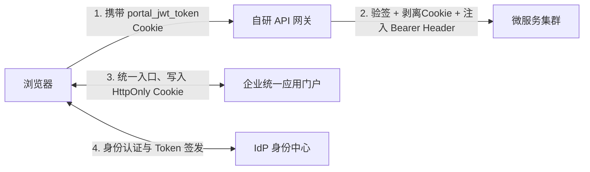
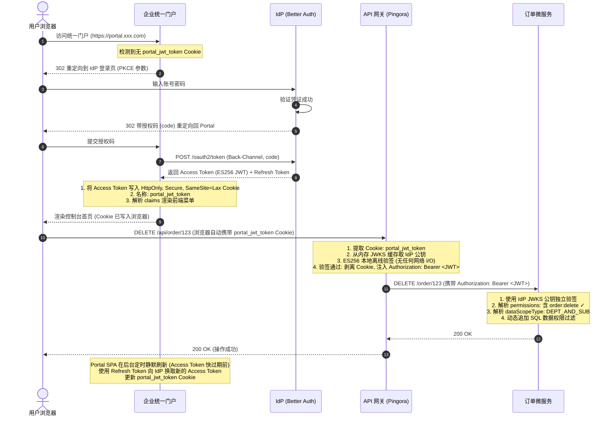

# Auth-SSO 基于自研 Gateway 的 OIDC 与微服务架构最佳实践指南

本方案针对**前后端分离**及**微服务架构**场景，设计并规范了自研 API 网关（Gateway，基于 Rust Pingora 编写）作为统一流量入口，与 Identity Provider（IdP，基于 Better Auth）、企业统一应用门户（Portal）以及后端微服务集群的集成架构与流转过程。

---

## 1. 核心概念与职责划分 (Responsibility Segregation)

为解决企业级 OIDC 接入时的职责混乱，我们将系统划分为四个核心组件，严格遵循**单一职责原则 (SRP)** 与**零信任 (Zero Trust)** 安全规范。

### 1.1 系统中的"双 Portal"职责明确

| 维度 | IdP 管理控制台 (Identity Control) | 企业统一应用门户 (Resource Portal) |
| :--- | :--- | :--- |
| **所属组件** | IdP 身份中心本身 (`apps/idp`) | 独立的门户系统 (`apps/portal`) |
| **使用者** | 系统管理员、运维人员 | 企业普通员工、应用管理员 |
| **核心职责** | 1. 全局用户账号管理<br/>2. 客户端注册 (Client Secrets 轮转)<br/>3. 全局角色与权限定义 | 1. 子应用注册与菜单维护<br/>2. 前端页面按钮/接口资源关联<br/>3. 建立角色与 Portal 本地菜单的映射 |
| **绝对禁区** | 1. 决不能管理应用菜单和按钮资源<br/>2. 决不能处理具体业务逻辑 | 1. 决不能管理全局用户账号与密码存储<br/>2. **决不能签发/生成任何令牌** |

### 1.2 OIDC 中 Scope 与 Claims 的规范用法

* **`scope` (客户端访问范围)**：只应包含标准 OIDC 属性（如 `openid`, `profile`, `email`, `offline_access`）。**决不能把用户的功能权限写入 scope**。
* **`claims` (令牌中的属性数据)**：用户的实际角色与权限必须作为自定义声明放入 claims 中。IdP 在签发 JWT 时根据当前请求的 `client_id` 进行权限裁剪（只注入该 Client 允许的权限子集）：

```json
{
  "sub": "usr_9x1s8f92138",
  "iss": "https://idp.example.com",
  "aud": "order-app-client",
  "exp": 1735689600,
  "jti": "tok_abc123",
  "name": "张三",
  "email": "zhangsan@corp.com",
  "roles": ["订单管理员"],
  "permissions": ["order:read", "order:write", "order:delete"],
  "deptId": "dept_001",
  "dataScopeType": "DEPT_AND_SUB"
}
```

### 1.3 整体组件职责追踪表



| 组件 | 核心职责 | 绝对不能做的事 |
| :--- | :--- | :--- |
| **IdP (Better Auth)** | 1. 全局用户管理与凭证校验<br/>2. 使用 ES256 私钥签发 JWT<br/>3. 暴露 `/.well-known/jwks` 公钥端点 | 1. 管理应用菜单、页面按钮资源<br/>2. 参与具体业务微服务的数据接口校验 |
| **企业统一门户 (Portal)** | 1. 注册和展示企业内所有子应用<br/>2. 作为 OIDC RP 获取 Token 并写入 HttpOnly Cookie<br/>3. 依据 Token claims 渲染前端菜单树 | 1. **签发任何令牌**（Portal 只是 OIDC Client）<br/>2. 进行接口级和数据级权限校验 |
| **自研网关 (Pingora)** | 1. 统一流量入口与路由限流<br/>2. 从 `portal_jwt_token` Cookie 提取 JWT<br/>3. 使用 IdP JWKS 公钥本地 ES256 验签<br/>4. 剥离 Cookie，注入 `Authorization: Bearer` 转发下游 | 1. 执行任何业务权限校验<br/>2. 连接 Redis 或数据库做在线状态查询<br/>3. 编写业务登录拦截和重定向逻辑 |
| **业务微服务 (Services)** | 1. 纯粹的业务逻辑处理与数据持久化<br/>2. 使用 IdP JWKS **独立验签**（不依赖网关背书）<br/>3. 接口级与数据级的硬拦截 | 1. 实现 OIDC 授权码/PKCE 交互逻辑<br/>2. 直接对接 IdP 进行用户会话管理 |

> **零信任原则**：微服务必须独立进行 JWKS 验签，不能基于"网关验过了"的假设盲目信任 Header。这是因为内网中其他服务（例如被攻陷的 Pod）可以直接访问微服务并构造任意 Header，绕过网关。

---

## 2. 端到端完整流程 (End-to-End Flow)

### 2.1 前置准备（管理员操作）

1. **IdP 端配置**：
   * 注册 OAuth 2.1 OIDC 客户端：`portal-client`（门户）、`order-app-client`（订单系统）
   * 创建用户：`张三`，创建角色：`订单管理员`
   * 给角色分配权限：`order:read`, `order:write`, `order:delete`
   * 将角色授予用户张三
2. **Portal 配置**：
   * 注册子应用："订单管理系统"
   * 创建菜单：`订单列表`、`创建订单`、`删除订单`
   * 配置角色映射：`订单管理员` → 显示三个菜单

### 2.2 用户访问与 API 鉴权完整时序图



---

## 3. 自研 Pingora 网关的 JWT 验签与中继实现

网关使用 IdP 的 **ES256 非对称公钥**（从 JWKS 端点动态缓存）进行本地离线验签，不做任何 RBAC 判断。

### 3.1 Cargo.toml 依赖配置

```toml
[dependencies]
async-trait = "0.1"
env_logger = "0.11"
log = "0.4"
pingora = { version = "0.8.0", features = ["openssl"] }
pingora-core = { version = "0.8.0", features = ["openssl"] }
pingora-http = "0.8.0"
pingora-load-balancing = { version = "0.8.0", features = ["openssl"] }
pingora-proxy = { version = "0.8.0", features = ["openssl"] }
openssl = { version = "0.10", features = ["vendored"] }
# JWT 验签：jsonwebtoken 支持 ES256 JWKS
jsonwebtoken = "9"
serde = { version = "1", features = ["derive"] }
serde_json = "1"
# 异步 HTTP 客户端（用于定时拉取 JWKS 公钥）
reqwest = { version = "0.12", features = ["json", "rustls-tls"], default-features = false }
tokio = { version = "1", features = ["sync", "time"] }
```

### 3.2 Rust 源码模块结构

```
apps/gateway/src/
├── main.rs       # 入口：环境配置加载、服务器初始化、JWKS 后台刷新
├── claims.rs     # JWT 载荷核心声明（Claims 结构体）
├── jwks.rs       # JWKS 公钥缓存（JwksCache 结构体 + refresh 方法）
├── gateway.rs    # 网关代理核心（Gateway 结构体 + ProxyHttp trait 实现）
└── redirect.rs   # HTTP→HTTPS 重定向服务（RedirectService + ProxyHttp 实现）
```

### 3.3 Pingora 网关核心实现（ES256 + JWKS + Cookie 提取）

```rust
use async_trait::async_trait;
use jsonwebtoken::{decode, Algorithm, DecodingKey, Validation};
use pingora_core::prelude::*;
use pingora_http::{RequestHeader, ResponseHeader};
use pingora_proxy::{ProxyHttp, Session};
use serde::{Deserialize, Serialize};
use std::sync::Arc;
use tokio::sync::RwLock;

/// JWT 载荷核心声明（Claims）
#[derive(Debug, Serialize, Deserialize)]
struct Claims {
    sub: String,
    iss: String,
    aud: String,
    exp: usize,
    jti: String,
}

/// JWKS 公钥缓存（由后台异步线程定时从 IdP 刷新）
/// 使用 RwLock 支持并发读与独占写，适合高并发网关场景
pub struct JwksCache {
    pub key: RwLock<Option<DecodingKey>>,
}

impl JwksCache {
    pub fn new() -> Arc<Self> {
        Arc::new(Self {
            key: RwLock::new(None),
        })
    }

    /// 从 IdP JWKS 端点异步拉取公钥并更新缓存
    pub async fn refresh(&self, jwks_url: &str) -> Result<(), Box<dyn std::error::Error>> {
        let resp = reqwest::get(jwks_url).await?;
        let jwks: serde_json::Value = resp.json().await?;
        // 取第一个 Key（生产环境下应按 kid 匹配 JWT Header 中的 kid 字段）
        if let Some(key_obj) = jwks["keys"].as_array().and_then(|a| a.first()) {
            let key_json = serde_json::to_string(key_obj)?;
            let decoding_key = DecodingKey::from_jwk(
                &serde_json::from_str(&key_json)?
            )?;
            let mut w = self.key.write().await;
            *w = Some(decoding_key);
        }
        Ok(())
    }
}

struct Gateway {
    /// Portal 上游负载均衡器（Portal 已合并 IdP，统一代理入口）
    portal_lb: Arc<pingora_load_balancing::LoadBalancer<pingora_load_balancing::selection::RoundRobin>>,
    /// 共享的 JWKS 公钥缓存（由 main 函数中后台任务定时刷新）
    jwks_cache: Arc<JwksCache>,
    /// Portal OIDC Provider 的 JWT 签发者（用于 iss claim 校验）
    issuer: String,
    /// 本网关服务的 audience（用于 aud claim 校验）
    audience: String,
}

#[async_trait]
impl ProxyHttp for Gateway {
    /// CTX 用于在 request_filter 和 upstream_request_filter 之间传递 JWT 字符串
    type CTX = Option<String>;
    fn new_ctx(&self) -> Self::CTX {
        None
    }

    /// 网关前置拦截器：从 Cookie 提取 JWT 并使用 ES256 JWKS 公钥离线验签
    async fn request_filter(&self, session: &mut Session, ctx: &mut Self::CTX) -> Result<bool> {
        let path = session.req_header().uri.path();

        // 1. 放行 OIDC/IdP 认证相关端点（登录、JWKS、回调等），防止循环拦截
        if path.starts_with("/api/auth/")
            || path.starts_with("/oauth2/")
            || path.starts_with("/.well-known/")
        {
            return Ok(false);
        }

        // 2. 从 Cookie 头部提取 portal_jwt_token
        // 使用 splitn(2, '=') 防止 JWT base64 中的 '=' padding 截断 token
        let jwt_token = session
            .get_header("Cookie")
            .and_then(|v| v.to_str().ok())
            .and_then(|cookie_str| {
                cookie_str.split(';').find_map(|part| {
                    let mut kv = part.trim().splitn(2, '=');
                    let key = kv.next()?.trim();
                    let val = kv.next()?.trim();
                    if key == "portal_jwt_token" {
                        Some(val.to_owned())
                    } else {
                        None
                    }
                })
            });

        let token = match jwt_token {
            Some(t) => t,
            None => {
                let mut header = ResponseHeader::build(401, None)?;
                header.insert_header("WWW-Authenticate", "Bearer")?;
                session.write_response_header(Box::new(header), true).await?;
                return Ok(true); // 拦截并阻断
            }
        };

        // 3. 从缓存中获取 JWKS 公钥（读锁，不阻塞其他请求）
        let key_guard = self.jwks_cache.key.read().await;
        let decoding_key = match key_guard.as_ref() {
            Some(k) => k,
            None => {
                log::error!("JWKS 公钥缓存尚未就绪，拒绝请求");
                let header = ResponseHeader::build(503, None)?;
                session.write_response_header(Box::new(header), true).await?;
                return Ok(true);
            }
        };

        // 4. 构建 ES256 校验参数（严格校验 iss 与 aud，防止跨服务 Token 重放攻击）
        let mut validation = Validation::new(Algorithm::ES256);
        validation.set_issuer(&[&self.issuer]);
        validation.set_audience(&[&self.audience]);

        match decode::<Claims>(&token, decoding_key, &validation) {
            Ok(token_data) => {
                log::info!(
                    "网关验签成功，sub={}, jti={}",
                    token_data.claims.sub,
                    token_data.claims.jti
                );
                *ctx = Some(token);
                Ok(false) // 放行
            }
            Err(e) => {
                log::warn!("网关 JWT 验签失败: {:?}", e);
                let header = ResponseHeader::build(401, None)?;
                session.write_response_header(Box::new(header), true).await?;
                Ok(true) // 拦截阻断
            }
        }
    }

    /// 网关转发拦截器：剥离 Cookie，注入 Bearer Token Header 下发至内网微服务
    async fn upstream_request_filter(
        &self,
        _session: &mut Session,
        upstream_request: &mut RequestHeader,
        ctx: &mut Self::CTX,
    ) -> Result<()> {
        // 注入协议头
        upstream_request.insert_header("X-Forwarded-Proto", "https")?;

        // 物理剥离 Cookie，防止内网微服务因 Cookie 泄露而遭受 CSRF 攻击
        upstream_request.remove_header("Cookie");

        // 将已验签的 JWT 以标准 Bearer Token 形式注入 Authorization Header
        if let Some(ref token) = *ctx {
            upstream_request.insert_header("Authorization", format!("Bearer {}", token))?;
        }

        Ok(())
    }
}
```

### 3.4 main 函数中的 JWKS 公钥后台定时刷新

```rust
// 在 main() 中启动后台异步任务，每 5 分钟刷新一次 JWKS 公钥缓存
// 支持 IdP 密钥轮换 (Key Rotation) 场景

let jwks_cache = JwksCache::new();
let cache_clone = Arc::clone(&jwks_cache);
let jwks_url = env::var("PORTAL_JWKS_URL")
    .unwrap_or_else(|_| "http://localhost:4000/api/auth/.well-known/jwks".to_string());

tokio::spawn(async move {
    loop {
        match cache_clone.refresh(&jwks_url).await {
            Ok(_) => log::info!("JWKS 公钥缓存刷新成功"),
            Err(e) => log::error!("JWKS 公钥缓存刷新失败: {:?}", e),
        }
        tokio::time::sleep(std::time::Duration::from_secs(300)).await; // 5 分钟轮询
    }
});
```

---

## 4. 微服务侧（硬拦截）最佳实践

微服务**独立使用 IdP 的 JWKS 公钥**对 JWT 进行完整验签，不能仅做 Base64 解码（`jwtDecode` 是不安全的）。内网任意服务都可能直接访问微服务接口，因此每一层都必须独立维护信任边界。

### 4.1 接口鉴权（Nest.js Guard，完整 JWKS 验签版本）

```typescript
import { Injectable, CanActivate, ExecutionContext, UnauthorizedException, OnModuleInit } from '@nestjs/common';
import { Reflector } from '@nestjs/core';
import { createRemoteJWKSet, jwtVerify, JWTPayload } from 'jose'; // jose 是业界标准的 JWKS 验签库

// 扩展 JWT 载荷的自定义 Claims 类型
interface AppClaims extends JWTPayload {
  roles: string[];
  permissions: string[];
  deptId: string;
  dataScopeType: 'ALL' | 'DEPT' | 'DEPT_AND_SUB' | 'SELF' | 'CUSTOM';
}

@Injectable()
export class PermissionsGuard implements CanActivate, OnModuleInit {
  // 远程 JWKS 验签集（jose 内部自动处理公钥缓存与 kid 匹配）
  private JWKS: ReturnType<typeof createRemoteJWKSet>;

  constructor(private reflector: Reflector) {}

  /**
   * 模块初始化时建立 JWKS 远程密钥集连接
   * jose 的 createRemoteJWKSet 会自动缓存并定期刷新公钥
   */
  onModuleInit() {
    const jwksUri = process.env.PORTAL_JWKS_URI ?? 'http://localhost:4000/api/auth/.well-known/jwks';
    this.JWKS = createRemoteJWKSet(new URL(jwksUri));
  }

  async canActivate(context: ExecutionContext): Promise<boolean> {
    const requiredPermissions = this.reflector.get<string[]>('permissions', context.getHandler());
    if (!requiredPermissions) {
      return true; // 接口公开，直接放行
    }

    const request = context.switchToHttp().getRequest();
    const authHeader: string | undefined = request.headers.authorization;

    if (!authHeader?.startsWith('Bearer ')) {
      throw new UnauthorizedException('缺少 Authorization Bearer Header');
    }

    const token = authHeader.slice(7);

    try {
      // 使用 jose 完整验签：校验签名 + exp + iss + aud
      // 内网微服务信任 IdP 的 JWKS，独立验签，不依赖网关
      const { payload } = await jwtVerify<AppClaims>(token, this.JWKS, {
        issuer: process.env.PORTAL_ISSUER ?? 'http://localhost:4000',
        audience: process.env.SERVICE_AUDIENCE ?? 'order-service',
        algorithms: ['ES256'],
      });

      // 权限声明比对
      const userPermissions = payload.permissions ?? [];
      const hasPermission = requiredPermissions.every((p) => userPermissions.includes(p));
      if (!hasPermission) {
        throw new UnauthorizedException('权限不足');
      }

      // 将用户上下文绑定至 Request 供 Controller 直接调用
      request.user = payload;
      return true;
    } catch (err) {
      throw new UnauthorizedException('JWT 验证失败');
    }
  }
}
```

---

## 5. Token 静默刷新与会话一致性

### 5.1 前端静默刷新机制（Portal SPA）

Portal 前端 SPA 需要在 Access Token 快过期前使用 Refresh Token 静默换取新 Token：

```typescript
// Portal 前端：后台定时静默刷新（Access Token 有效期 1h，提前 5 分钟刷新）
class SessionManager {
  private timer: ReturnType<typeof setInterval> | null = null;

  start() {
    // 每 55 分钟静默刷新一次（Access Token 默认 1h 有效期）
    this.timer = setInterval(async () => {
      try {
        const res = await fetch('/api/auth/refresh', { method: 'POST', credentials: 'include' });
        if (!res.ok) {
          // 刷新失败：Refresh Token 已过期或被撤销，强制重新登录
          window.location.href = '/login';
        }
        // 刷新成功：Portal BFF 会自动将新的 Access Token 写入 HttpOnly Cookie
      } catch {
        window.location.href = '/login';
      }
    }, 55 * 60 * 1000);
  }

  stop() {
    if (this.timer) clearInterval(this.timer);
  }
}
```

### 5.2 紧急撤销机制（Token 黑名单）

对于需要秒级生效的强制下线场景（如账号封禁、密码修改），采用 jti 黑名单 + Redis Pub/Sub 广播机制：

```mermaid
flowchart LR
    Portal["Portal 管理端"] -->|1. 写入 jti 黑名单 (TTL=剩余有效期)| Redis["Redis"]
    Redis -->|2. Pub/Sub 广播 jti| GW1["网关节点 1 (内存)"]
    Redis -->|2. Pub/Sub 广播 jti| GW2["网关节点 2 (内存)"]
    GW1 -..->|3. 本地内存检查 jti 黑名单 (无 Redis I/O)| Filter["L1 内存布隆过滤器"]
```

网关在验签通过后，额外检查 jti 是否在本地内存黑名单中：

```rust
// 网关 request_filter 中，在 JWKS 验签通过后追加黑名单检查
if self.jti_blocklist.contains(&token_data.claims.jti) {
    log::warn!("Token jti 已被吊销: {}", token_data.claims.jti);
    let header = ResponseHeader::build(401, None)?;
    session.write_response_header(Box::new(header), true).await?;
    return Ok(true);
}
```
