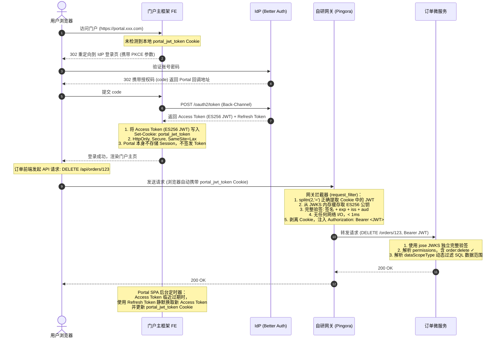
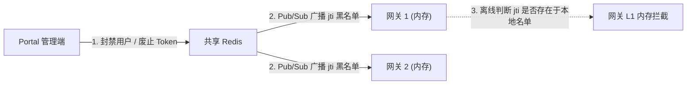
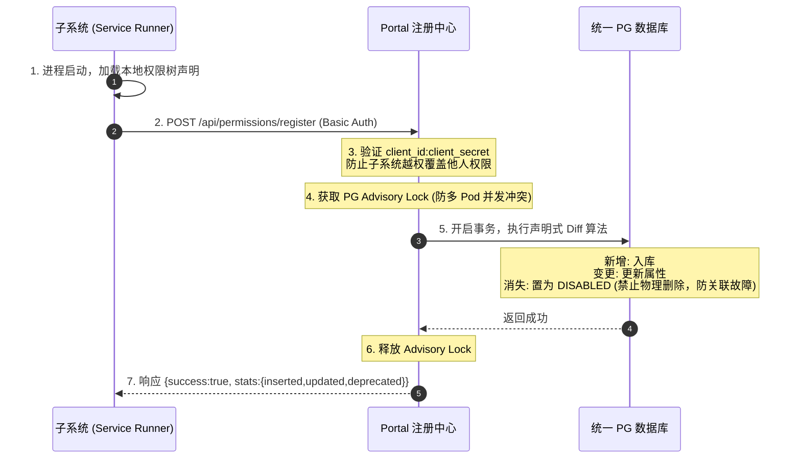

# 基于"巨大门户 (Portal)"的去中心化 OIDC 与统一权限设计白皮书

本白皮书针对"**Portal 本身是一个巨大门户，所有系统接入 Portal**"的业务背景，提出并规范了一套**"去中心化（Decentralized）"**的单点登录（SSO）与统一权限管控设计，确保系统在高并发、零信任环境下的极致性能与安全。

---

## 1. 痛点审视与去中心化理念

在以 Portal 为主体的大型应用生态中，"中心化"会话校验（即网关每次请求都要去查询 Redis / 认证服务来校验 Session）存在严重的架构隐患：
* **性能瓶颈**：高并发下，Redis 会成为系统的单点瓶颈与性能天花板。
* **高耦合与服务雪崩**：若会话缓存或认证中心发生故障，网关无法校验任何请求，导致全网子应用瞬间瘫痪（雪崩效应）。

### 1.1 去中心化核心设计
为彻底打破中心化依赖，我们设计了**"无状态 JWT Cookie 传递 + 网关本地离线验签 + 微服务分布式消费"**的去中心化鉴权模型：

1. **会话无状态化 (Stateless JWT Cookie)**：用户仅在 Portal 发起登录。登录成功后，**IdP (Better Auth)** 作为唯一凭证发行方，将用户的身份、所属部门、激活的角色与权限子集封装进一个经过 **ES256 私钥签名**的 **JWT 格式 Access Token** 中。
2. **同源传递安全保障**：Portal BFF 作为 OIDC 客户端，从 IdP 换取该 Access Token 后，在服务端将其作为 **HttpOnly, Secure, SameSite=Lax Cookie**（命名为 `portal_jwt_token`）写入浏览器。Portal 本身不存储会话，也不签发任何 Token。
3. **网关去中心化验签 (Zero-IO Gateway)**：自研网关（Rust Pingora）拦截到子系统 API 请求后，直接从 Cookie 提取 `portal_jwt_token`，使用本地内存中缓存的**非对称 ES256 公钥（从 IdP 的 JWKS 端点定时拉取）**进行**纯 CPU 离线签名与过期校验**。**网关不需要发起任何网络 I/O（不查 Redis、不调接口），实现了 100% 的去中心化判定。**
4. **下游 Bearer 透传**：网关验签通过后，将 Cookie 剥离以防内网 CSRF，在 Request Header 中注入 `Authorization: Bearer <JWT>` 转发给下游微服务。
5. **微服务独立验签（零信任）**：微服务**不能盲目信任网关**，必须使用 IdP 的 JWKS 公钥自行完整验签（签名 + exp + iss + aud），然后解析权限 claims 执行接口拦截与 SQL 数据过滤。

### 1.2 严格的 Token 权属与职责解耦

为确保分布式信任链（Trust Chain）的物理完整性，我们必须严格厘清 Token 权属：

* **IdP (Better Auth) 是唯一的 Token 签发与签名中心 (Issuer)**：
  * 只有 IdP 持有 **ES256 非对称加密私钥**，并对外暴露标准公钥端点 `/.well-known/jwks`。
  * 所有 Token（JWT 格式）的数字签名必须由 IdP 私钥生成，且网关和微服务必须使用公钥验签，不能使用对称密钥（HS256）。
* **Portal 仅作为 Token 的消费、中继与 Cookie 写入方 (Client/RP)**：
  * **Portal 绝不生成、签发或修改任何 Token 签名**。Portal 仅是标准的 OIDC Relying Party。
  * 当用户在 Portal 登录时，Portal 引导重定向并取得 Code，通过 Back-Channel 将 Code 发送给 IdP 换取 Token。
  * 换取成功后，Portal 将从 IdP 拿到的 **JWT Access Token** 写入浏览器同域的 `portal_jwt_token` Cookie 中（HttpOnly, Secure, SameSite=Lax）。
* **网关与微服务均独立使用 IdP 的 JWKS 公钥验签**：
  * 网关从 `/.well-known/jwks` 定时缓存 ES256 公钥，每次请求纯 CPU 离线验签。
  * 微服务也独立使用 JWKS 公钥验签（推荐使用 `jose` 库的 `createRemoteJWKSet`），不能仅做 Base64 解码（`jwtDecode` 不验签，存在安全漏洞）。

---

## 2. 去中心化系统拓扑与数据流向

```mermaid
flowchart TD
    subgraph Browser_Domain ["用户浏览器 (Portal 宿主同源域)"]
        PortalFE["门户主框架 SPA<br/>(portal.example.com)"]
        SubAppFE["子应用前端 (微前端/Iframe)<br/>(嵌入在 Portal 内)"]
    end

    subgraph Gateway_Domain ["网关层 (自研 Rust Pingora)"]
        Gateway["自研网关<br/>(ES256 JWKS 离线验签 / Cookie→Bearer 中继)"]
        JWKS_Cache["JWKS 公钥缓存<br/>(后台定时从 IdP 刷新)"]
    end

    subgraph Auth_Domain ["统一认证中心 (IdP)"]
        IdP["IdP (Better Auth)<br/>(idp.example.com)"]
    end

    subgraph Service_Domain ["业务微服务集群 (内网隔离)"]
        OrderService["订单微服务<br/>(独立 JWKS 验签 + AOP 权限拦截)"]
        SharedDB[("共享 PostgreSQL<br/>(Drizzle 关系 Schema)")]
    end

    %% 登录与写入 Token Cookie
    PortalFE <-->|1. 统一登录 (OIDC/PKCE)| IdP
    IdP -->|2. 签发 ES256 JWT，Portal 写入 Cookie: portal_jwt_token| PortalFE
    IdP -..->|3. 定时同步 JWKS 公钥| JWKS_Cache

    %% 去中心化 API 调用流
    SubAppFE -->|4. 发起请求 (带 portal_jwt_token Cookie)| Gateway
    Gateway -..->|5. 从内存 JWKS 缓存取公钥 ES256 离线验签 (无任何网络 I/O)| JWKS_Cache
    Gateway -->|6. 剥离 Cookie, 注入 Authorization: Bearer JWT| OrderService
    OrderService -..->|7. 独立 JWKS 验签 (零信任)| IdP
    OrderService <-->|8. SQL 数据权限过滤| SharedDB
```

---

## 3. 去中心化动态交互场景详解



---

## 4. 核心代码改造设计

### 4.1 网关端去中心化验签改造（Cargo.toml + Rust 实现）

**Cargo.toml 需新增的依赖：**

```toml
[dependencies]
jsonwebtoken = "9"          # ES256 JWKS 验签
serde = { version = "1", features = ["derive"] }
serde_json = "1"
reqwest = { version = "0.12", features = ["json", "rustls-tls"], default-features = false }
tokio = { version = "1", features = ["sync", "time"] }
```

**核心网关代码（关键改动点）：**

```rust
use async_trait::async_trait;
use jsonwebtoken::{decode, Algorithm, DecodingKey, Validation};
use pingora_core::prelude::*;
use pingora_http::{RequestHeader, ResponseHeader};
use pingora_proxy::{ProxyHttp, Session};
use serde::{Deserialize, Serialize};
use std::sync::Arc;
use tokio::sync::RwLock;

/// JWT 载荷声明（验签使用，仅验证必要字段）
#[derive(Debug, Serialize, Deserialize)]
struct Claims {
    sub: String,
    iss: String,
    exp: usize,
    jti: String,
}

/// JWKS 公钥缓存：由后台任务每 5 分钟从 IdP 刷新
/// 使用 RwLock 支持高并发读 + 独占写
pub struct JwksCache {
    pub key: RwLock<Option<DecodingKey>>,
}

impl JwksCache {
    pub fn new() -> Arc<Self> {
        Arc::new(Self {
            key: RwLock::new(None),
        })
    }

    /// 从 IdP JWKS 端点拉取公钥并更新缓存
    /// 生产环境应按 JWT Header 中的 kid 字段匹配对应 Key
    pub async fn refresh(&self, jwks_url: &str) -> Result<(), Box<dyn std::error::Error>> {
        let resp = reqwest::get(jwks_url).await?;
        let jwks: serde_json::Value = resp.json().await?;
        if let Some(key_obj) = jwks["keys"].as_array().and_then(|a| a.first()) {
            let key = DecodingKey::from_jwk(&serde_json::from_value(key_obj.clone())?)?;
            *self.key.write().await = Some(key);
        }
        Ok(())
    }
}

struct Gateway {
    /// Portal 上游负载均衡器（Portal 已合并 IdP，统一代理入口）
    portal_lb: Arc<LoadBalancer<RoundRobin>>,
    jwks_cache: Arc<JwksCache>,
    issuer: String,
    gateway_audience: String,
}

#[async_trait]
impl ProxyHttp for Gateway {
    type CTX = Option<String>; // 在 request_filter 和 upstream_request_filter 间传递 JWT
    fn new_ctx(&self) -> Self::CTX { None }

    /**
     * 网关前置拦截器：ES256 JWKS 离线验签，100% 无网络 I/O
     */
    async fn request_filter(&self, session: &mut Session, ctx: &mut Self::CTX) -> Result<bool> {
        let path = session.req_header().uri.path();

        // 放行认证和 OIDC 相关路由
        if path.starts_with("/api/auth/")
            || path.starts_with("/oauth2/")
            || path.starts_with("/.well-known/")
        {
            return Ok(false);
        }

        // 从 Cookie 正确提取 portal_jwt_token
        // 关键：使用 splitn(2, '=') 防止 JWT 中的 base64 '=' padding 截断 token 值
        let jwt_token = session
            .get_header("Cookie")
            .and_then(|v| v.to_str().ok())
            .and_then(|s| {
                s.split(';').find_map(|part| {
                    let mut kv = part.trim().splitn(2, '=');
                    match (kv.next(), kv.next()) {
                        (Some(k), Some(v)) if k.trim() == "portal_jwt_token" => {
                            Some(v.trim().to_owned())
                        }
                        _ => None,
                    }
                })
            });

        let token = match jwt_token {
            Some(t) => t,
            None => {
                let header = ResponseHeader::build(401, None)?;
                session.write_response_header(Box::new(header), true).await?;
                return Ok(true);
            }
        };

        // 从 JWKS 缓存取公钥（读锁，不阻塞并发请求）
        let key_guard = self.jwks_cache.key.read().await;
        let decoding_key = match key_guard.as_ref() {
            Some(k) => k,
            None => {
                log::error!("JWKS 公钥缓存未就绪");
                let header = ResponseHeader::build(503, None)?;
                session.write_response_header(Box::new(header), true).await?;
                return Ok(true);
            }
        };

        // ES256 验签（严格校验 iss 和 aud，防止跨服务 Token 重放攻击）
        let mut validation = Validation::new(Algorithm::ES256);
        validation.set_issuer(&[&self.issuer]);
        validation.set_audience(&[&self.gateway_audience]);

        match decode::<Claims>(&token, decoding_key, &validation) {
            Ok(_) => {
                *ctx = Some(token);
                Ok(false) // 验签通过，放行
            }
            Err(e) => {
                log::warn!("网关离线验签失败: {:?}", e);
                let header = ResponseHeader::build(401, None)?;
                session.write_response_header(Box::new(header), true).await?;
                Ok(true) // 拦截阻断
            }
        }
    }

    /**
     * 网关转发拦截器：剥离 Cookie，注入 Bearer Token Header
     */
    async fn upstream_request_filter(
        &self,
        _session: &mut Session,
        upstream_request: &mut RequestHeader,
        ctx: &mut Self::CTX,
    ) -> Result<()> {
        upstream_request.insert_header("X-Forwarded-Proto", "https")?;
        // 物理剥离 Cookie，防止内网 CSRF 渗透
        upstream_request.remove_header("Cookie");
        // 注入标准 Bearer Token Header
        if let Some(ref token) = *ctx {
            upstream_request.insert_header("Authorization", format!("Bearer {}", token))?;
        }
        Ok(())
    }
}
```

**main 函数中的 JWKS 后台刷新任务：**

```rust
// 在 main() 中启动后台异步线程，每 5 分钟刷新 JWKS 公钥
let jwks_cache = JwksCache::new();
let jwks_url = std::env::var("PORTAL_JWKS_URL")
    .unwrap_or_else(|_| "http://localhost:4101/.well-known/jwks".to_string());
let cache_for_task = Arc::clone(&jwks_cache);

tokio::spawn(async move {
    loop {
        match cache_for_task.refresh(&jwks_url).await {
            Ok(_)  => log::info!("JWKS 公钥缓存刷新成功"),
            Err(e) => log::error!("JWKS 公钥缓存刷新失败: {:?}", e),
        }
        tokio::time::sleep(std::time::Duration::from_secs(300)).await;
    }
});
```

---

## 5. 去中心化架构下的实时性与高一致性保障

在完全去中心化、网关不连库不查 Redis 的情况下，如何确保管理员在 Portal 对用户进行的"封禁账户、修改角色权限"的操作能够近乎实时地在网关和微服务中生效？

### 5.1 方案 A：短生命周期 Token 结合前端静默刷新（标准方案）

* **设计原理**：将 Access Token 的过期时间（`exp`）设置为 **15 分钟到 1 小时**（Better Auth 当前默认 1h）。
* **刷新机制**：Portal SPA 使用 `setInterval` 在后台定时（例如每 55 分钟）使用 Refresh Token 向 Portal BFF 请求刷新，由 BFF 后端换取新 Access Token 并更新 Cookie，前端无感知。
* **权限生效**：当管理员变更权限时，用户下一次 Token 刷新时 IdP 会颁发含新权限的 JWT。最大延迟等于 Access Token 的剩余有效期。

```typescript
// Portal SPA：后台静默刷新（Token 即将过期时触发）
class SessionManager {
  start(accessTokenExpAt: number) {
    const refreshBefore = 5 * 60 * 1000; // 提前 5 分钟刷新
    const delay = (accessTokenExpAt * 1000) - Date.now() - refreshBefore;
    setTimeout(async () => {
      const res = await fetch('/api/auth/refresh', { method: 'POST', credentials: 'include' });
      if (!res.ok) window.location.href = '/login';
      // 刷新成功：Portal BFF 自动更新 portal_jwt_token Cookie
    }, Math.max(delay, 0));
  }
}
```

### 5.2 方案 B：本地内存布隆过滤器结合 Redis 发布订阅（紧急撤销）

对于需要"秒级下线"的金融级安全要求，引入**被动撤销机制**，依然保持网关的去中心化：



1. **写黑名单**：管理员禁用账户时，Portal 将该 Token 的 `jti` 写入 Redis 废弃黑名单（设置 TTL = Token 剩余有效时间）。
2. **Pub/Sub 广播**：Portal 向 Redis Channel 发送广播消息。
3. **网关秒级同步**：Pingora 后台订阅该 Channel，收到 `jti` 废弃消息后立即写入**本地内存布隆过滤器或极速哈希表**。
4. **离线高一致判定**：网关在 ES256 验签通过后，加一步检查 `jti` 是否存在于本地内存黑名单中。**全程无跨网络 I/O，保持网关去中心化的性能。**

---

## 6. 声明式权限自动同步注册 (方案 A) 规范流程

为了实现"权限定义分布式、授权关系集中式"的架构愿景，特制定本子应用权限自动同步注册设计规范。

### 6.1 Drizzle Schema 扩展（permissions 表新增 clientId）

```typescript
// apps/portal/src/db/schema.ts
export const permissions = pgTable('permissions', {
  id: text('id').primaryKey(),
  publicId: text('public_id').notNull().unique(),
  name: text('name').notNull(),
  code: text('code').notNull().unique(), // 建议格式：client_id:module:action
  type: permissionTypeEnum('type').notNull().default('API'), // 'MENU' | 'API' | 'DATA'
  resource: text('resource'),   // API 路由或前端路由
  action: text('action'),       // HTTP 方法或 CLICK 等
  parentId: text('parent_id'),
  clientId: text('client_id').references(() => clients.clientId, { onDelete: 'cascade' }), // 归属子系统
  status: entityStatusEnum('status').notNull().default('ACTIVE'),
  sort: integer('sort').default(0),
  createdAt: timestamp('created_at').notNull().defaultNow(),
  updatedAt: timestamp('updated_at').notNull().defaultNow(),
});
```

### 6.2 权限声明元数据格式规范（permissions.json）

```json
[
  {
    "code": "order:menu",
    "name": "订单管理",
    "type": "MENU",
    "resource": "/orders",
    "action": "VIEW",
    "sort": 1,
    "children": [
      {
        "code": "order:create",
        "name": "创建订单",
        "type": "API",
        "resource": "/api/orders",
        "action": "POST"
      },
      {
        "code": "order:btn:refund",
        "name": "退款操作按钮",
        "type": "DATA",
        "resource": "order-refund-btn",
        "action": "CLICK"
      }
    ]
  }
]
```

### 6.3 自动注册同步核心流程



**安全原则**：
- 子系统仅能操作其自身 `client_id` 绑定的权限记录，Physical isolation 防止越权。
- 废弃权限使用**软删除**（DISABLED），保留 `role_permissions` 关联，由管理员手动审批下线，防止自动删除导致在线用户权限崩溃。
