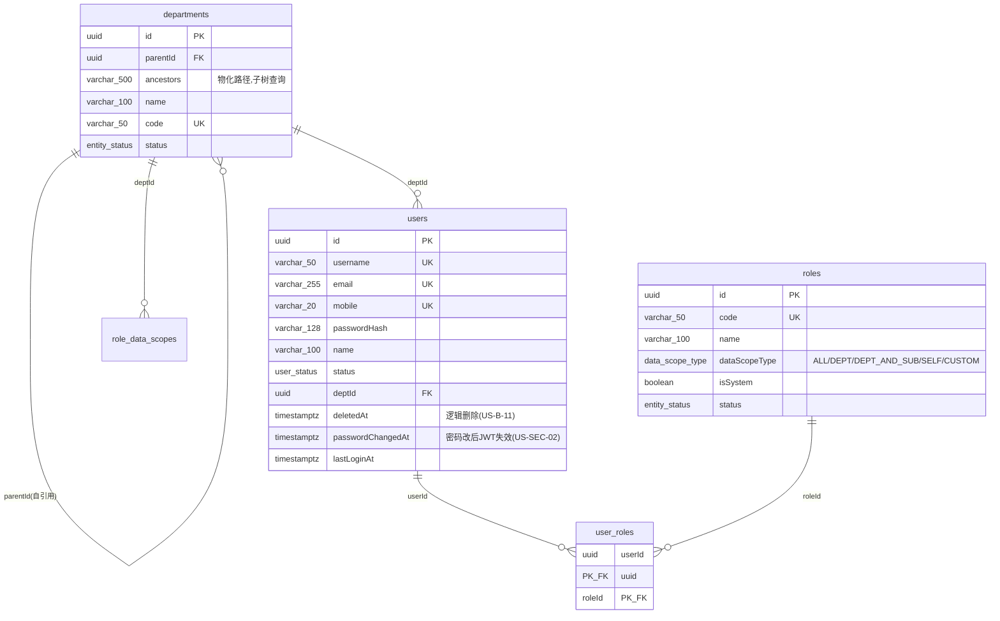
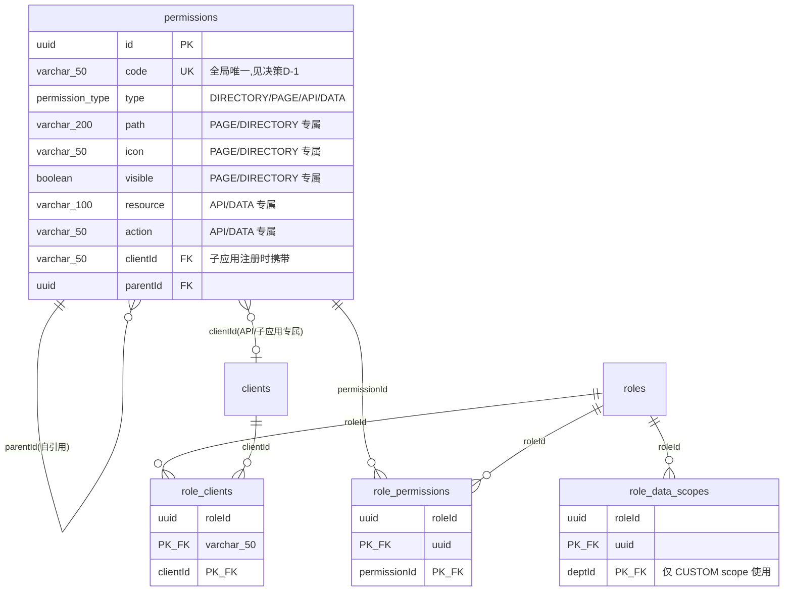

# Auth-SSO 数据库设计 DBA 审查报告

> 审查日期：2026-06-22
> 基线：`apps/portal/src/db/schema/*.ts`（v2 重构后）+ `apps/portal/drizzle/0000~0002.sql`
> 对照：[REQUIREMENTS_MATRIX.md](./REQUIREMENTS_MATRIX.md)、[USER_STORIES.md](./USER_STORIES.md)、[DATABASE_REDESIGN.md](./DATABASE_REDESIGN.md)

## 一、总体结论

重构后的 schema **TS 层设计质量很高**（消除双主键、合并 menus、token 哈希化、`uuid + timestamptz + varchar(n)`），15 张表的领域划分清晰，关联表全部复合主键，方向完全正确。

**但存在一个 P0 级阻断问题和若干落地偏差**，导致「设计图」与「实际可运行数据库」严重脱节。当前状态下，任何全新部署 `drizzle migrate` 得到的是**旧 schema**，代码与 seed 脚本均无法运行。

---

## 二、UML 表结构图（按领域）

### 领域 1：组织与身份（核心实体）

### 领域 2：统一权限树（RBAC + 菜单 + 子应用声明式注册）

### 领域 3：OIDC 协议与日志（append-only）

```mermaid
erDiagram
    clients ||--o{ access_tokens : "clientId"
    clients ||--o{ refresh_tokens : "clientId"
    clients ||--o{ authorization_codes : "clientId"
    users ||--o{ access_tokens : "userId"
    users ||--o{ refresh_tokens : "userId"
    clients {
        varchar_50 clientId PK
        varchar_100 name
        varchar_128 clientSecret "nullable,公开客户端"
        varchar_255_array redirectUris
        varchar_200 scopes
        integer accessTokenTtl
        integer refreshTokenTtl
        entity_status status
    }
    access_tokens {
        uuid id PK
        varchar_64 tokenHash UK "SHA256,非明文"
        varchar_50 clientId FK
        uuid userId FK
        varchar_200 scopes
        timestamptz expiresAt "应 NOT NULL"
    }
    refresh_tokens {
        uuid id PK
        varchar_64 tokenHash UK
        varchar_50 clientId FK
        uuid userId FK
        timestamptz revoked
        timestamptz expiresAt "应 NOT NULL"
    }
    audit_logs {
        uuid id PK
        uuid userId "无FK,审计合规"
        varchar_50 username "冗余,防用户删除"
        audit_operation operation
        jsonb params
        smallint status
    }
    login_logs {
        uuid id PK
        uuid userId "无FK"
        varchar_50 username
        login_event eventType
        varchar_100 location
    }
```

---

## 三、permissions 多 type 模型的完整链路（重点）

v2 的 `permission_type` 取值 `DIRECTORY | PAGE | API | DATA`，对应两条消费链路：

| 来源 | type 用途 | 字段使用 | 现状 |
|---|---|---|---|
| **Portal 核心**（`seed-rbac.ts`） | 仅 `API`（`user:list` 等鉴权点） | resource/action 不填，clientId 为 null | seed 全部 type='API' |
| **子应用声明式注册**（`POST /api/permissions/register`） | DIRECTORY/PAGE/API/DATA 全用 | clientId = 注册方 client | **register 契约缺 path/icon/visible** |

### 已发现的链路断点

1. **register 契约不完整**：`IncomingPermission` 接口只有 `code/name/type/resource/action/sort/children`，未携带 `path/icon/visible`。子应用注册 PAGE/DIRECTORY 菜单节点时**无法传入路由与图标**，schema 的菜单字段对子应用形同虚设。
2. **code 全局唯一性 vs 按 client 语义**：`permissions.code` 是全局 UK，但 register 按 clientId 注册。若两个子应用注册同名 code（如 `order:list`），第二个写入触发唯一约束冲突。
3. **Portal 自身边栏（US-A-01）无 PAGE 种子**：动态侧边栏所需 PAGE/DIRECTORY 节点未在 seed 中创建，目前疑似由前端 layout 硬编码。需确认 PAGE 类型在 Portal 自身是否真的被消费，否则属于死设计。

---

## 四、字段必要性审计（有用 vs 堆砌）

### ✅ 每个字段都能追溯到业务需求

| 字段 | 支撑需求 | 评价 |
|---|---|---|
| `users.deletedAt` | US-B-11 逻辑删除 | 必要 |
| `users.passwordChangedAt` | US-SEC-02 多设备会话失效 | 必要 |
| `roles.dataScopeType` | US-C-07 / US-RBAC-04 数据沙箱 | 必要，5 值枚举精准 |
| `role_data_scopes` | US-CROSS-07 CUSTOM 跨部门 | 仅 CUSTOM 生效，无冗余行 |
| `departments.ancestors` | US-B-02 DEPT_AND_SUB 子树查询 | 性能列，物化路径合理 |
| `access_tokens.tokenHash` | US-OIDC-04 introspection | 哈希替代明文，安全正确 |

**没有发现堆砌字段**。重构砍掉了 `public_id`、`consents`、`menus.component`、`menus.permission_code` 等，砍得干净。

### ⚠️ 存疑/可优化字段

1. **`access_tokens.expiresAt` / `refresh_tokens.expiresAt` 允许 NULL** —— 语义上令牌必有过期，应 `notNull()`。
2. **`jwks.kid` nullable** —— JWKS 轮换靠 `kid` 匹配 JWT header，应 `notNull()`。
3. **`logs.ip` 实际是 `varchar(45)` 而非重设计文档承诺的 `inet`** —— 与设计文档不一致，需二选一。
4. **`permissions` 的类型专属列全部 nullable** —— 靠应用层 Zod 保证鉴别，DB 层无 CHECK 兜底（详见 P1-1）。

---

## 五、范式与易用性权衡评估

| 设计点 | 范式视角 | 易用性视角 | DBA 判定 |
|---|---|---|---|
| `departments` 同时存 `parentId`（邻接表）+ `ancestors`（物化路径） | 违反 3NF | 子树查询从 O(递归 CTE) 降到 O(LIKE) | ✅ **正确的反范式**，有迁移回填脚本 |
| `permissions` 合并 menus（单表多态） | 子类型字段大量 NULL | 一棵树统一管理，减少 JOIN | ✅ **正确**，但需 CHECK 约束兜底 |
| `audit_logs.username` 冗余存储 | 违反 3NF | 用户删除后审计仍可读（合规刚需） | ✅ **正确的反范式** |
| OAuth `scopes` 用空格分隔字符串 | 违反 1NF | RFC 6749 / JWT `scope` claim 原生格式 | ✅ **正确**，符合标准 |
| `clients.clientId` 作 PK（自然键） | 用业务键作主键 | OAuth 语义直接，FK 引用统一 | ✅ **正确** |

**结论**：所有反范式决策都有明确的性能/合规/标准合规理由，没有为「灵活性」而反范式。

---

## 六、业务需求覆盖度

- **完全覆盖**：模块 B 用户、C 角色、D 权限、F 部门、G 客户端、H 认证/会话/SSO、OIDC 协议。
- **需确认覆盖**：模块 E 菜单管理 —— 重构合并 menus→permissions 后，US-E-05「菜单绑定权限 Code」、US-A-01「动态侧边栏」的数据源与渲染方式需与产品确认（见第三节链路断点 3）。
- **文档漂移（非 schema 问题）**：
  - US-B-09「用户资料包含 `public_id`」→ 重构已删除，文档需更新。
  - US-CROSS-07「存储到 `role_departments`」→ 实际表名 `role_data_scopes`，文档需更新。
  - `permissions/page.tsx` 文案「支持 API/MENU/DATA 三种类型」→ MENU 已不存在。
  - `permissions/data.ts` 注释「支持内部 ID 和 publicId」→ publicId 已删除。

---

## 七、问题清单（按优先级）

### 🔴 P0：迁移未重新生成 + seed 脚本失效（阻断部署）

`drizzle/0000~0002.sql` 仍是旧 schema（text PK、public_id、menus 表、consents 表、`permission_type=MENU/API/DATA`、token 明文）。同时 `scripts/seed-rbac.ts` 未对齐 v2：
- 向 `rolePermissions` 插入已删除的 `id` 列 → 运行时报错。
- `seedRole` 重复写入 `id`。
- 权限全部 `type:'API'`，未利用多 type。

**后果**：全新部署 `drizzle migrate` + `seed-rbac` 全链路失败。

### 🟠 P1-1：permissions 鉴别联合缺 CHECK 约束

`rbac.ts:88-90` 注释承诺「PG CHECK 约束作为第二道防线，通过 raw SQL 添加」，但全仓库找不到任何 raw SQL CHECK。DIRECTORY 权限可同时填 resource/action 而 DB 不报错，完整性只靠 Zod。

### 🟠 P1-2：复合主键表存在冗余索引

`role_permissions` / `role_data_scopes` / `role_clients` 都同时建了：
- `ux_*_pk (fk1, fk2)` 复合唯一索引（左前缀已覆盖 fk1）
- `idx_*_fk1 (fk1)` ← **冗余**（btree 复合索引左前缀已服务此查询）

3 张表各 1 个冗余索引可删。反向 fk2 索引保留。

### 🟠 P1-3：register 契约与 schema 多 type 字段脱节

`IncomingPermission` 缺 `path/icon/visible`，子应用 PAGE/DIRECTORY 菜单注册残缺（见第三节）。

### 🟡 P2-1：令牌表 expiresAt 应 NOT NULL
### 🟡 P2-2：`logs.ip` 类型与设计文档不符（varchar(45) vs inet）
### 🟡 P2-3：code 全局唯一性需明确为 (clientId, code) 复合唯一或全局命名空间

---

## 八、DBA 建议（按优先级执行）

1. **立刻**：`drizzle-kit generate` 重新生成迁移，修复 seed-rbac.ts，解决 P0 部署阻断。
2. **短期**：补 permissions CHECK 约束（P1-1）、清理冗余索引（P1-2）、令牌 expiresAt 改 notNull（P2-1）。
3. **对齐**：确认模块 E 菜单的实际渲染方式；补全 register 契约的 path/icon/visible（P1-3）；明确 code 唯一性范围（P2-3）。
4. **文档**：清理 USER_STORIES / page.tsx / data.ts 中的 public_id、role_departments、MENU 等过期引用。

---

## 九、总评

**设计本身：A-**。领域划分、反范式取舍、类型选型都到位，多 type 权限模型的方向（统一权限树 + 子应用声明式注册）是先进的。

**落地完整度：C+**。迁移漂移（P0）、seed 失效、CHECK 约束承诺未兑现、register 契约半成品。**修完 P0 + P1 后可达 A**。
