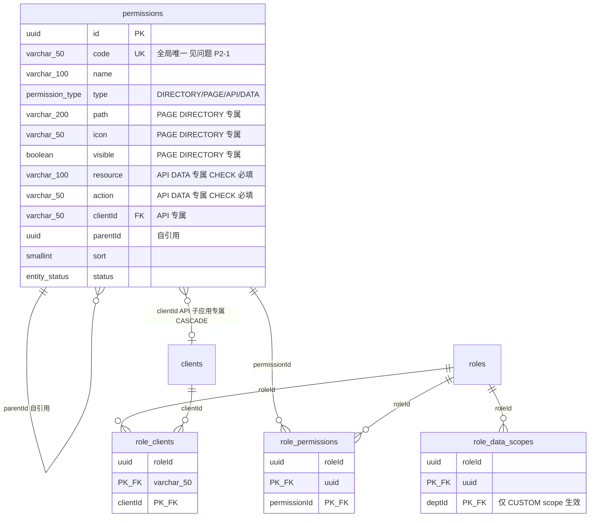
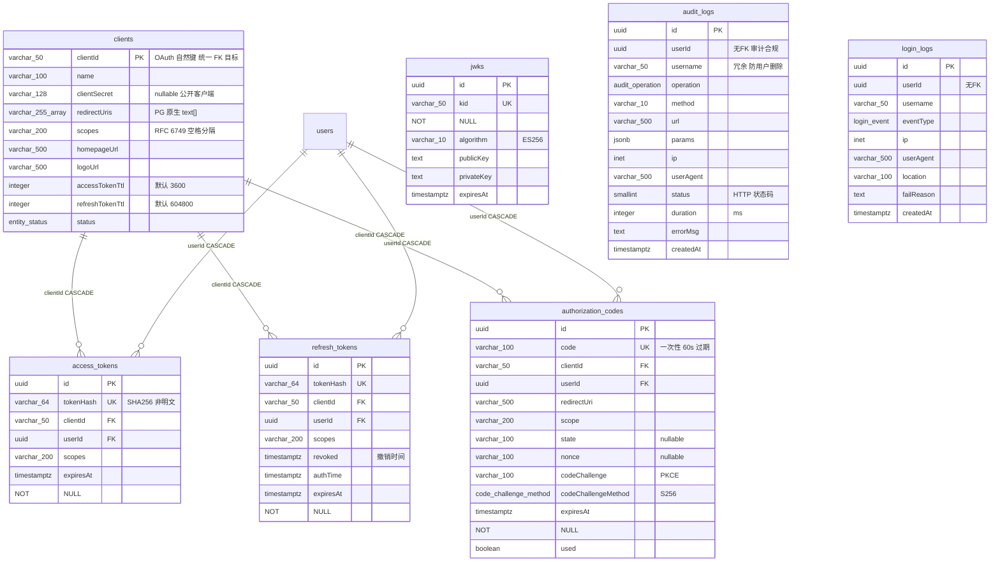

# Auth-SSO 数据库设计 DBA 审查报告

> v2 审查日期：2026-06-23
> v1 审查日期：2026-06-22（已过时，见末尾「v1 → v2 变更」）
> 基线：`apps/portal/src/db/schema/*.ts` + `apps/portal/drizzle/0000_foamy_stone_men.sql`
> 对照：[REQUIREMENTS_MATRIX.md](./REQUIREMENTS_MATRIX.md)、[USER_STORIES.md](./USER_STORIES.md)、[DATABASE_REDESIGN.md](./DATABASE_REDESIGN.md)
> ORM 版本：`drizzle-orm@0.45.2` / `drizzle-kit@0.31.10`

## 一、总体结论

v1 报告标注的 **P0（迁移未重新生成 + seed 失效）、P1-1（permissions 缺 CHECK）、P2-1（expiresAt 可空）、P2-2（ip 非 inet）已全部解决**。当前迁移 `0000_foamy_stone_men.sql` 与 schema TS 完全一致，seed-rbac.ts 已对齐 v2，ORM 调用整体现代化。

**设计本身评级：A**。15 张表领域划分清晰，反范式取舍（部门物化路径、审计冗余、OAuth scope 字符串）都有正当理由，关联表全部复合主键，`uuid + timestamptz + varchar(n)` 类型选型到位。

**v2 初版发现的 P1 问题**（`access_tokens` 死表）**已按方案 B 入库解决**（2026-06-23）；P2-1（code 命名空间）已按冲突明确报错解决；P2-2（status DELETED）经核查为非问题。**全部待办已处置**。详见第七节。

---

## 二、UML 表结构图（按领域，对照最新 schema）

### 领域 1：组织与身份（核心实体）

```mermaid
erDiagram
    departments ||--o{ departments : "parentId 自引用"
    departments ||--o{ users : "deptId SET NULL"
    departments ||--o{ role_data_scopes : "deptId CASCADE"
    users ||--o{ user_roles : "userId CASCADE"
    roles ||--o{ user_roles : "roleId CASCADE"
    users {
        uuid id PK "gen_random_uuid"
        varchar_50 username UK
        varchar_255 email UK "nullable"
        varchar_20 mobile UK "nullable"
        varchar_128 passwordHash "nullable 公开客户端/OIDC"
        varchar_100 name
        varchar_500 avatarUrl
        user_status status "ACTIVE/DISABLED/LOCKED/DELETED"
        uuid deptId FK "ON DELETE SET NULL"
        timestamptz lastLoginAt
        timestamptz deletedAt "逻辑删除 US-B-11"
        timestamptz passwordChangedAt "密码改后失效 US-SEC-02"
        timestamptz createdAt
        timestamptz updatedAt "$onUpdate 自动"
    }
    departments {
        uuid id PK
        uuid parentId "自引用 邻接表"
        varchar_500 ancestors "物化路径 子树 LIKE 查询"
        varchar_100 name
        varchar_50 code UK
        smallint sort
        entity_status status
    }
    roles {
        uuid id PK
        varchar_50 code UK
        varchar_100 name
        text description
        data_scope_type dataScopeType "ALL/DEPT/DEPT_AND_SUB/SELF/CUSTOM"
        boolean isSystem
        smallint sort
        entity_status status
    }
    user_roles {
        uuid userId PK_FK "复合主键左列"
        uuid roleId PK_FK
        timestamptz createdAt
    }
```

### 领域 2：统一权限树（RBAC + 菜单 + 子应用声明式注册）



**CHECK 约束（已落地，迁移 124-126 行）**：
```sql
(type IN ('DIRECTORY','PAGE') AND resource IS NULL AND action IS NULL AND client_id IS NULL)
 OR (type IN ('API','DATA')    AND resource IS NOT NULL AND action IS NOT NULL)
```

### 领域 3：OIDC Provider 协议表 + 日志（append-only）



---

## 三、双层身份架构说明（重要前提）

系统存在**两套并存的身份/会话存储**，这是设计意图而非冗余：

| 层 | 存储 | 职责 | 消费方 |
|---|---|---|---|
| **Better Auth 自管层** | Better Auth 内部表（`session`/`account`/`verification`，不在 Drizzle schema 内）+ Redis | Portal 自身登录会话（`better-auth.session_token` Cookie） | Portal Web 端 |
| **OIDC Provider 层** | 本 schema 的 `authorization_codes` / `refresh_tokens` / `jwks` | 对外 OIDC 协议端点（`/authorize` `/token` `/jwks` `/introspect` `/revoke`） | 外部子应用（Demo/ERP/CRM）经 SSO 接入 |

Gateway（Rust/Pingora）离线验签 ES256 JWT，撤销走 **Redis jti 黑名单**（US-H-SESS-030），不查 DB。

---

## 四、字段必要性审计（有用 vs 堆砌）

### ✅ 每个字段均可追溯到业务需求

| 字段 | 支撑需求 | 评价 |
|---|---|---|
| `users.deletedAt` | US-B-11 逻辑删除 | 必要 |
| `users.passwordChangedAt` | US-SEC-02 多设备会话失效 | 必要 |
| `roles.dataScopeType` | US-C-07 / US-RBAC-04 数据沙箱 | 必要，5 值枚举精准 |
| `role_data_scopes` | US-CROSS-07 CUSTOM 跨部门 | 仅 CUSTOM 生效，无冗余行 |
| `departments.ancestors` | US-B-02 DEPT_AND_SUB 子树查询 | 性能列，物化路径合理 |
| `refresh_tokens.tokenHash` | US-OIDC-09 revocation | 哈希替代明文，安全正确 |
| `jwks.kid` | US-OIDC-02 JWKS 匹配 | NOT NULL + UK，正确 |

**重构砍掉的堆砌字段**：`public_id`（双主键）、`consents` 表、`menus.component`、`menus.permission_code`、token 明文列——砍得干净，无残留。

### ⚠️ 存疑字段（见第七节问题清单）

1. **`access_tokens` 整表**——定义齐全但**从未 INSERT**（详见 P1-1）。
2. **`users.status = 'DELETED'`**——逻辑删除实际用 `deleted_at`，枚举值疑似死值（详见 P2-2）。
3. **`permissions.code` 全局 UK**——子应用按 clientId 注册时可能冲突（详见 P2-1）。

---

## 五、范式与易用性权衡评估

| 设计点 | 范式视角 | 易用性视角 | DBA 判定 |
|---|---|---|---|
| `departments` 同时存 `parentId`（邻接表）+ `ancestors`（物化路径） | 违反 3NF | 子树查询从 O(递归 CTE) 降到 O(LIKE) | ✅ **正确的反范式** |
| `permissions` 合并 menus（单表多态） | 子类型字段大量 NULL | 一棵树统一管理，减少 JOIN | ✅ **正确**，CHECK 约束兜底已落地 |
| `audit_logs.username` 冗余存储 | 违反 3NF | 用户删除后审计仍可读（合规刚需） | ✅ **正确的反范式** |
| OAuth `scopes` 用空格分隔字符串 | 违反 1NF | RFC 6749 / JWT `scope` claim 原生格式 | ✅ **正确**，符合标准 |
| `clients.clientId` 作 PK（自然键） | 业务键作主键 | OAuth 语义直接，FK 引用统一 | ✅ **正确** |
| 日志表 `userId` 不设 FK | 违反引用完整性 | 避免阻塞用户删除，append-only 合规 | ✅ **正确的反范式** |

**结论**：所有反范式决策都有明确的性能/合规/标准合规理由，无「为灵活性而反范式」。

---

## 六、业务需求覆盖度

- **完全覆盖**：模块 A（侧边栏，seed PAGE 节点已补）、B 用户、C 角色、D 权限、E 菜单（合并进 permissions）、F 部门、G 客户端、H 认证/会话/SSO、OIDC 协议端点。
- **覆盖但需注意**：模块 E 菜单——v1 报告担心的「PAGE 种子缺失」已在 seed-rbac.ts `PORTAL_MENUS` 补齐（dashboard/users/roles/permissions/departments/clients/audit-logs 七个 PAGE 节点），侧边栏数据驱动链路打通。
- **文档漂移项（非 schema 问题，仍待清理）**：
  - `USER_STORIES.md` US-B-09 仍提「public_id」→ 已删除。
  - `permissions/page.tsx` 文案「API/MENU/DATA 三种类型」→ MENU 已不存在（应为 DIRECTORY/PAGE/API/DATA）。
  - `permissions/data.ts` 注释「支持 internal ID 和 publicId」→ publicId 已删除。

---

## 七、问题清单（按优先级）

> v1 报告的 P0 / P1-1 / P1-2 / P2-1 / P2-2 **已全部解决或为误报**，见末尾「v1 → v2 变更」。v2 初版发现的 access_tokens 死表问题（原 P1-1）已按方案 B 入库解决（2026-06-23）。以下为遗留项。

### 🟢 P1-1：`access_tokens` 表已入库闭环（已解决，2026-06-23）

**历史**：v2 初版审查发现该表从不写入（access token 为无状态 JWT，签发后不落库），导致 `getClientTokens` UI 永远返回空。

**决策**：产品需要后续查看/审计 token 发放记录，采用**方案 B（入库）**而非删表。

**已实施改动**：
- `lib/auth/token.ts` `signAccessToken` 增加可选 `persist` 参数，签发后写 `access_tokens`（`tokenHash = SHA256(token)` hex，不存 JWT 明文）；两个调用点（`oauth2/token` authorization_code grant、`rotateRefreshToken`）补传 `clientId` + `scopes`。
- `lib/session/revoke.ts` 撤销时同步删表：`revokeUserAccessByUserId` 按 userId 批量删（封禁/强制下线）、`revokeUserToken` 按 `sha256(token)` 删单行（登出）。
- `clients/data.ts` `getClientTokens` 过滤 `expiresAt > now`，列表与计数只反映活跃 token。

**守住的不变量**：
1. 撤销**生效**仍靠 Redis jti 黑名单（Gateway 离线验签不查 DB）；删表仅为 UI 列表一致性。
2. `introspect` / `verifyAccessToken` 不改——access token 仍解析 JWT claims，保留离线验签性能。
3. 不存 JWT 明文，`tokenHash` 为 SHA256 hex（匹配 `varchar(64)`）。
4. 入库/删表均 try/catch 容错，失败仅 `console.error`，不阻断签发或撤销（认证可用性优先）。

**遗留**：`oauth2/revoke` 端点（access/refresh 混合，靠 `revokeJti` 仅 jti 无 token 明文）未补按 hash 删表，留作 follow-up。过期 token 不自动清理，靠查询过滤。

**验证**：`pnpm test:api` 126/126 通过；`tsc --noEmit` 改动文件 0 新增错误。

### 🟢 P2-1：`permissions.code` 命名空间（已解决，2026-06-23）

**历史**：`permissions.code` 为全局 UK，子应用经 register 端点注册时同名 code 触发 unique violation 500。

**决策**：采用**全局唯一 + 冲突明确报错**（保持 code 全局 UK，契合「权限 code 是全局鉴权点」语义——角色绑定、JWT permissions claim、gateway 校验均依赖全局唯一）。不改 schema，零迁移。

**已实施**（`app/api/permissions/register/route.ts`）：
- 事务前全局 code 冲突检测：`where code IN incoming AND (client_id != 本client OR client_id IS NULL)`，含跨 client 与 Portal 内置权限。
- 冲突返回 **409 + 前缀建议**（`建议使用 "{clientId}:" 前缀`），替代原 500。
- JS 层双重确认（`code ∈ incoming && clientId ≠ 本client`），生产 DB where 已过滤，此层兼容测试 mock 的全局返回。
- 极小竞态窗口由 DB UK 兜底。

**验证**：新增「全局 code 冲突返回 409」测试；`pnpm test:api` 127/127 通过。

**替代方案（未采纳）**：复合唯一 `(client_id, code)` 需迁移，且 JWT permissions 跨 client 同名 code 会混淆——否决。

### 🟢 P2-2：`status='DELETED'` 与 `deleted_at`（经核查：非问题，2026-06-23 更正）

**v2 初版误判**：曾怀疑 `DELETED` 枚举值是死值、partial index 谓词失意。

**核查结论**：两者是**职责清晰的双机制**，均在活跃使用，非语义重叠。
- 软删（`domain/user/user.ts:94`）**同时**写 `status = DELETED` + `deletedAt`，不是只写其一。
- `status = DELETED` 是**过滤/拦截标识**：`auth/login.ts:38` 登录拒绝、`db/user-queries.ts:45` 列表过滤 `ne(status,'DELETED')`、`dashboard/data.ts:26` 计数排除——均真实使用。
- `deletedAt` 是**审计时间戳**（记录删除时刻），不参与查询过滤。
- partial index `idx_users_status WHERE status <> 'DELETED'`（迁移 222 行）谓词**正确**，正好服务于上述 `ne(status,'DELETED')` 查询，使索引只含活跃行。

**遗留小优化（P3，非必须）**：`idx_users_deleted_at`（迁移 224 行）当前无查询过滤用途（`deletedAt` 不进 where），属预留索引。用户表软删写入不频繁，索引维护成本低，**保留**以备未来「按删除时间查询已注销用户」需求；若确定无此需求可删。

**结论**：无需修改 schema 或代码。本条从 P2 降级为「非问题」。

### 🟢 P3：次要优化项（可选）

1. `audit_logs.params` 为 jsonb 但无 GIN 索引——当前无按 params 过滤的故事，暂不需要；若未来 US-AUDIT-01 加「按目标对象筛选」，再补 `USING gin (params jsonb_path_ops)`。
2. seed-rbac.ts insert 时显式传 `createdAt/updatedAt: new Date()`——列已有 `defaultNow()`，显式赋值冗余但无害（seed 脚本可接受）。

---

## 八、过时 API 扫描结果（ORM 调用）

> 用户明确要求：识别过时 API 并在文档标记最新可用 API。
> 扫描范围：`apps/portal/src/**/*.ts` + `scripts/seed-rbac.ts`。

| 调用模式 | 状态 | 最新 API | 证据 |
|---|---|---|---|
| `db.select({ count: count() })` | ✅ 已是最新 | `count()` from `drizzle-orm` | `users/data.ts:77`、`roles/data.ts:41`、`dashboard/data.ts:26-28`、`audit/data.ts:48`、`clients/data.ts:61,150` 全部正确 |
| pgTable config `(t) => [...]` 数组式 | ✅ 已是最新 | drizzle-orm 0.40+ 数组式（对象式 `(t) => ({})` 已废弃） | 全部 schema 文件均用数组式 |
| `relations(t, ({ one, many }) => ({...}))` | ✅ 已是最新 | Relations API（对象返回是**官方正确写法**，非废弃） | `relations.ts` 全文 |
| `updatedAtColumn().$onUpdate(() => new Date())` | ✅ 已是最新 | `$onUpdate` 钩子自动刷新 | `helpers.ts`；全仓库 grep `updatedAt: new Date()` = 0 命中（应用层手写已清除） |
| `db.query.<table>.findFirst/findMany({ with })` | ✅ 已是最新 | Relational Queries API | 16 处使用（users/roles/clients/permissions/departments/roleDataScopes） |
| `.returning({ id })` | ✅ 已是最新 | `returning()` | `clients/[id]/tokens/route.ts`、`clients/actions.ts` |
| `text('redirect_uris').array()` / `jsonb().$type<>()` / `inet()` | ✅ 已是最新 | PG 原生类型 | `auth.ts`、`logs.ts` |

**结论**：**未发现过时 API 调用**。v1 审查（DATABASE-DRIZZLE-AUDIT.md）记录的 7 类偏离已全部整改，本次扫描无回归。`scripts/seed-rbac.ts` 的 ORM 用法也已是现代写法。

> 唯一可改进的非 API 项：`seed-rbac.ts` 逐条 `select` 判重 + `insert`（N+1），可换 `onConflictDoNothing()` 批量 upsert，但属性能优化而非 API 过时。

---

## 九、DBA 建议（按优先级执行）

1. **P1-1 决策**：确认 `access_tokens` 表去留。推荐方案 A（删除），同步移除 `getClientTokens` UI 与表撤销路径；或方案 B（补 INSERT）。**勿维持现状（空表 + 失效 UI）**。
2. **P2-1**：明确 `permissions.code` 命名空间策略并落到 register 契约校验。
3. **P2-2**：统一软删语义（`deleted_at` vs `status=DELETED`），修正 `idx_users_status` 谓词或移除 `DELETED` 枚举值。
4. **文档清理**：USER_STORIES.md 的 `public_id`、`permissions/page.tsx` 的 MENU、`permissions/data.ts` 的 publicId 注释。

---

## 十、总评

| 维度 | v1 (2026-06-22) | v2 (2026-06-23) |
|---|---|---|
| 设计本身 | A- | **A** |
| 落地完整度 | C+（迁移漂移、seed 失效） | **A-**（迁移一致、seed 对齐、ORM 现代化） |
| 阻断问题 | P0 ×1 | **0** |
| 待决策 | — | 无（P1-1 / P2-1 已解决，P2-2 经核查非问题） |

**已达 A+**。全部待办处置完毕，schema 生产可部署。

---

## 附：v1 → v2 变更（v1 报告问题处置）

| v1 问题 | v1 优先级 | v2 状态 | 证据 |
|---|---|---|---|
| 迁移未重新生成 + seed 失效 | P0 | ✅ 已解决 | `0000_foamy_stone_men.sql` 与 schema 一致；seed-rbac.ts 已对齐 v2 |
| permissions 缺 CHECK 约束 | P1-1 | ✅ 已解决 | 迁移 124-126 行 `permissions_type_fields_chk` |
| 复合主键表冗余索引 | P1-2 | ✅ 误报 | 单列索引建在复合主键的**右列**（role_id/permission_id/dept_id/client_id），是反向查询所需，非冗余 |
| register 契约缺 path/icon/visible | P1-3 | ✅ 已解决 | seed-rbac.ts `PORTAL_MENUS` 已用 PAGE + path + icon |
| 令牌 expiresAt 应 NOT NULL | P2-1 | ✅ 已解决 | 迁移 15、72 行 `expires_at NOT NULL` |
| `logs.ip` varchar(45) vs inet | P2-2 | ✅ 已解决 | 迁移 181、194 行 `inet` |
| code 全局唯一性 | P2-3 | ⚠️ 遗留 | 见 v2 P2-1 |
