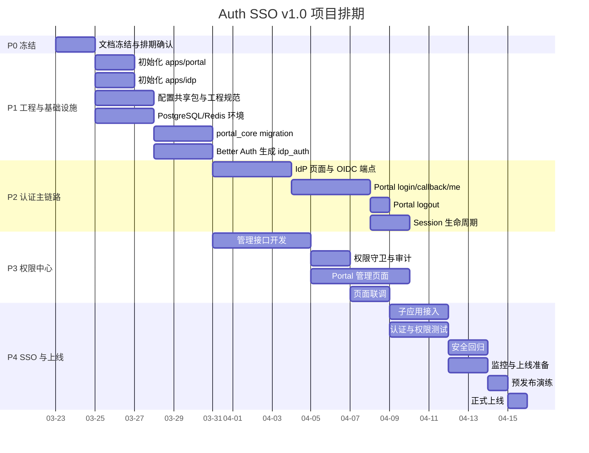

# 小企业统一门户 + SSO + 权限中心项目排期与任务清单

- 版本：`v1.0`
- 角色视角：`项目经理 / 研发负责人`
- 适用范围：需求冻结后进入研发排期、周会推进、里程碑跟踪

---

## 1. 排期目标

在 `4 周` 内完成 v1.0 最小可上线版本，范围包括：

- `apps/portal` 门户与管理后台
- `apps/idp` 独立认证 Web 应用
- `Portal Session / IdP Session / Token` 生命周期
- RBAC 管理能力
- 至少 1 个子应用 SSO 接入
- 基础审计与安全能力

---

## 2. 角色分工

建议最小配置：

- `PM / 产品`：1 人
- `前端`：1 人
- `Portal 后端`：1 人
- `认证后端`：1 人
- `测试`：1 人
- `运维 / DevOps`：0.5 人

职责建议：

- `PM / 产品`
  - 需求冻结
  - 页面验收
  - 跨角色协调
- `前端`
  - `apps/portal` 页面开发
  - Portal 登录态交互
  - 管理后台页面联调
- `Portal 后端`
  - BFF
  - RBAC
  - 管理接口
  - 审计日志
- `认证后端`
  - Better Auth
  - OIDC
  - IdP Session
  - 用户与认证身份联动
- `测试`
  - 认证链路
  - 权限链路
  - 安全回归
- `运维 / DevOps`
  - PostgreSQL
  - Redis
  - HTTPS
  - 日志、监控、告警

---

## 3. 项目阶段

| 阶段 | 周期 | 目标 | 输出 |
| --- | --- | --- | --- |
| P0 | 第 1 周前半 | 启动与冻结 | 边界确认、排期确认 |
| P1 | 第 1 周 | 工程与基础设施 | 可开发工程、DB/Redis 环境 |
| P2 | 第 2 周 | 认证主链路 | 登录、回调、登出、`/api/me` |
| P3 | 第 3 周 | 权限中心与页面 | 管理接口、Portal 页面 |
| P4 | 第 4 周 | SSO 联调、测试、上线准备 | 子应用接入、测试报告、上线单 |

---

## 4. 任务列表

## 4.1 P0 启动与冻结

| 编号 | 任务 | 负责人 | 依赖 | 输出 |
| --- | --- | --- | --- | --- |
| T01 | 确认主文档冻结 | PM | 无 | 冻结版主文档 |
| T02 | 确认技术栈与插件范围 | 架构 / 认证后端 | T01 | 技术冻结结论 |
| T03 | 确认页面范围与 v1.0 不做项 | PM / 前端 | T01 | 页面冻结结论 |
| T04 | 确认数据落位与数据库边界 | 架构 / 后端 | T01 | 数据边界结论 |
| T05 | 确认排期与里程碑 | PM | T01-T04 | 研发排期稿 |

## 4.2 P1 工程与基础设施

| 编号 | 任务 | 负责人 | 依赖 | 输出 |
| --- | --- | --- | --- | --- |
| T11 | 初始化 `apps/portal` | 前端 | T05 | Portal 工程 |
| T12 | 初始化 `apps/idp` | 认证后端 | T05 | IdP 工程 |
| T13 | 初始化 `packages/contracts` | Portal 后端 | T05 | 共享契约包 |
| T14 | 初始化 `packages/config` | Portal 后端 | T05 | 配置包 |
| T15 | 配置 `shadcn/ui + tailwindcss@latest` | 前端 | T11 | UI 基础 |
| T16 | 配置 TypeScript strict / ESLint | 前端 / 后端 | T11-T14 | 工程规范 |
| T17 | 准备 PostgreSQL / Redis | 运维 | T05 | 基础环境 |
| T18 | 创建 `portal_core` schema 与业务表 | Portal 后端 | T17 | 业务 migration |
| T19 | 配置 Better Auth 并生成 `idp_auth` | 认证后端 | T12,T17 | Better Auth schema |
| T20 | 建立日志、env、错误处理 | 全栈 | T11-T19 | 基础运行框架 |

## 4.3 P2 认证主链路

| 编号 | 任务 | 负责人 | 依赖 | 输出 |
| --- | --- | --- | --- | --- |
| T21 | 实现 IdP 登录页 / 认证确认页 / 错误页 | 认证后端 | T12,T19 | IdP 页面 |
| T22 | 配置 `/authorize /token /userinfo /jwks` | 认证后端 | T19 | OIDC 能力 |
| T23 | 实现 `GET /api/auth/login` | Portal 后端 | T18,T22 | 登录入口 |
| T24 | 实现 `portal:auth:txn:{state}` | Portal 后端 | T17,T23 | 登录临时上下文 |
| T25 | 实现 `GET /api/auth/callback` | Portal 后端 | T22-T24 | 回调逻辑 |
| T26 | 实现 `Portal Session` 建立与 Cookie | Portal 后端 | T25 | 登录态 |
| T27 | 实现 `GET /api/me` | Portal 后端 | T26 | 当前用户接口 |
| T28 | 实现 `POST /api/auth/logout` | Portal 后端 / 认证后端 | T26 | 登出能力 |
| T29 | 联调 Portal 登录主链路 | 前端 / 后端 | T21-T28 | 登录联调完成 |

## 4.4 P3 Session 与权限中心

| 编号 | 任务 | 负责人 | 依赖 | 输出 |
| --- | --- | --- | --- | --- |
| T31 | 实现 `idle timeout / absolute timeout` | Portal 后端 | T26 | Session 生命周期 |
| T32 | 实现 refresh 懒刷新 | Portal 后端 | T26,T22 | Token 刷新 |
| T33 | 实现用户、部门、角色管理接口 | Portal 后端 | T18 | 管理接口 |
| T34 | 实现权限、菜单、Client 管理接口 | Portal 后端 | T18 | 管理接口 |
| T35 | 实现密码重置、强制下线、审计接口 | Portal 后端 | T18,T22 | 安全接口 |
| T36 | 实现权限码守卫与数据范围判定 | Portal 后端 | T33-T35 | RBAC 后端 |
| T37 | 开发 Portal 工作台与导航页 | 前端 | T11,T15,T27 | Portal 页面 |
| T38 | 开发用户 / 部门 / 角色 / 权限页面 | 前端 | T33,T36 | 管理页面 |
| T39 | 开发 Client / 审计 / 无权限页 | 前端 | T34,T35 | 管理页面 |
| T40 | 完成 Portal 页面联调 | 前端 / Portal 后端 | T37-T39 | 页面联调完成 |

## 4.5 P4 SSO、测试与上线准备

| 编号 | 任务 | 负责人 | 依赖 | 输出 |
| --- | --- | --- | --- | --- |
| T41 | 注册测试 Client | Portal 后端 | T34 | 测试 Client |
| T42 | 接入首个子应用 | 认证后端 / Portal 后端 | T22,T41 | 接入样例 |
| T43 | 验证 SSO 与登出后重新登录 | 测试 | T42,T28 | SSO 验证结果 |
| T44 | 认证链路测试 | 测试 | T29,T31,T32 | 测试结果 |
| T45 | 权限与页面测试 | 测试 | T40 | 测试结果 |
| T46 | 安全测试 | 测试 / 后端 | T43-T45 | 安全回归结果 |
| T47 | 配置监控、日志、告警 | 运维 | T17,T20 | 可观测性基础 |
| T48 | 准备上线检查单与回滚方案 | PM / 运维 / 后端 | T44-T47 | 发布材料 |
| T49 | 预发布演练 | 全员 | T48 | 预发布记录 |
| T50 | 正式上线 | 全员 | T49 | v1.0 上线 |

---

## 5. 周排期

## 第 1 周

- T01-T05
- T11-T20

目标：

- 工程可启动
- PostgreSQL / Redis 可用
- `portal_core` 初版可落地
- Better Auth 可生成 `idp_auth`

## 第 2 周

- T21-T29
- T31-T32

目标：

- Portal 登录链路打通
- `/api/me` 可用
- 登出可用
- Session 生命周期规则开始生效

## 第 3 周

- T33-T40

目标：

- 管理接口基本完成
- Portal 管理后台页面基本完成
- 权限守卫可用

## 第 4 周

- T41-T50

目标：

- 首个子应用接入完成
- 测试与安全回归完成
- 上线检查完成

---

## 6. 关键依赖关系

- `T19 Better Auth schema` 先于 `T22 OIDC 端点`
- `T22 OIDC 端点` 先于 `T23-T29 Portal 登录链路`
- `T26 Portal Session` 先于 `T27 /api/me`、`T28 logout`、`T31-T32 生命周期`
- `T33-T36 管理接口与权限守卫` 先于 `T38-T40 管理页面联调`
- `T41 测试 Client` 先于 `T42 子应用接入`
- `T44-T46 测试` 先于 `T48-T50 上线`

---

## 7. 甘特图

---

## 8. 里程碑检查点

### M1 检查点

- Portal / IdP 工程可启动
- DB / Redis 环境可用
- Better Auth schema 可生成

### M2 检查点

- 登录链路打通
- `/api/me` 正常
- logout 正常

### M3 检查点

- Session 生命周期生效
- refresh 逻辑生效
- 登出后不能自动重新登录

### M4 检查点

- 用户、部门、角色、权限、Client 管理可用
- 管理后台页面可联调

### M5 检查点

- 子应用接入成功
- SSO 成功

### M6 检查点

- 测试通过
- 安全回归通过
- 可上线

---

## 9. 风险与缓冲

高风险项：

- Better Auth 配置与文档预期不一致
- Cookie / 域名 / HTTPS 策略不一致导致 SSO 异常
- `portal_core.clients` 直连只读消费边界实现不当
- 页面开发量超预期

建议缓冲：

- 第 2 周末保留 `1-2 天` 认证联调缓冲
- 第 4 周保留 `2 天` 安全测试与上线缓冲

---

## 10. 上线判定标准

满足以下条件才允许上线：

- 登录、登出、`/api/me` 正常
- Portal 登出后不能自动重新登录
- 至少 1 个子应用已完成接入验证
- RBAC 管理能力可用
- 审计日志可查
- 无高危安全问题
- 预发布演练通过
